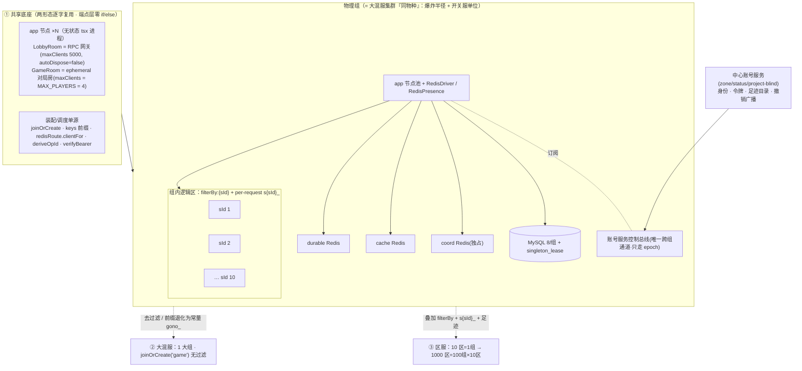

# 双形态服务器架构设计规格：大混服 + 区服(1000×1000)

## 文档状态

> ⚠ **本文是前瞻性设计规格，尚未实施。** 它描述「让当前架构同时支持大混服与区服」的目标形态，扩展并部分改写 [SERVER.md §9.5 扩容模型 ADR](SERVER.md)（原 ADR 立场：扩容单位 = 区服实例、单区服多节点不在承诺内）。现网仍是单形态骨架（玩法为 demo，见 [OVERVIEW.md](OVERVIEW.md) / [SERVER.md](SERVER.md)）。落地按 §5 里程碑推进，§9 未决项须先拍板。

本规格是「同一套 Colyseus 0.17 代码同时承载大混服与区服」的工程落地规格。其结论由 **8 轮技术评审锁定的 7 项决策** 为前提（不再论证「是否该这么做」，只写「怎么落地」），并经 **61 条服务端规则的两份对抗式评审对撞校验**（钱/幂等/跨存储 一份，鉴权/网关/冷档/撤销 一份）后定稿。评审指出的所有阻断级正确性洞（MySQL 谓词分区、ALS-vs-列概念二分、撤销传输层缺失、前缀孤儿化、F4 误判、快路径 epoch 窗口）已在正文改对；当场无法收敛者列入 §9「未决与风险」。本规格与源码逐一核对，文件锚点为仓库相对路径（`apps/server/src/...` 等）。

---

## 1. 架构总览与两级分区

### 1.1 一图看清三块

系统是「同一共享底座 + 两组装配开关」，而非三份代码：



关键读法：`app.config.ts` 中被注释的 `driver: RedisDriver() / presence: RedisPresence()` 一旦翻开，单进程即变横向集群——**这就是「物理组」，与「一个大混服集群」是同一物种**。区服不是另一套架构，只是在同物种上叠 `filterBy:{sId}` 与前缀。§9.5 ADR「单区多节点=另一套架构」真正硬的只有「持久跨节点强一致态」，而对局房 `GameRoom` 是 ephemeral（随全员退出 `autoDispose`），彻底绕开它。

### 1.2 两级分区模型

- **物理组** = 一个横向 Colyseus cluster（N 个 app 节点 + RedisDriver/RedisPresence）+ 独立 `{durable, cache, coord}` 三类 Redis + 每组一套 MySQL 8（含 `singleton_lease`）。物理组是爆炸半径与开关服的最小单位。
- **逻辑区（sId）** = 组内两件事隔离：① 匹配 `defineRoom(GameRoom).filterBy(['sId'])`；② 数据 per-request 前缀 `s{sId}_`（Redis 键，`keys.ts` 唯一拼接点从启动常量改为 ALS 上下文注入）。

**演进节奏——逻辑隔离先行、物理分组后加**：

| 阶段 | 物理组 | 逻辑区 | Redis/MySQL |
|---|---|---|---|
| 10 区起步 | 1 组 | 10 sId 共享，靠 filterBy+前缀 | 1 套三件 + 1 MySQL |
| 1000 区 | 100 组 × 10 区 | 代码零改动 | 每组独立三件 + 1 MySQL |
| 大混服 | 1 大组，不过滤 | 常量前缀 `gono_`，无 sId 维度 | 1 大套 |

### 1.3 两形态差异只收敛到三处

端点文件（`websocket/*`、`http/*`、`rooms/GameRoom.ts`）**永不写 `if (大混服)`**。差异被隔离到：① **装配层**（`app.config.ts` 是否 `filterBy`、driver/presence 是否翻开）；② **调度层**（`keys.ts` 前缀来源、`redisRoute.clientFor` 的 group 路由、`deriveOpId` 是否编码 sId）；③ **部署拓扑**（一组一套 Redis/MySQL、路由表）。后台 worker 从 `gameplay_outbox.server_id` 恢复区上下文，解决「per-request 前缀打穿到无请求的 worker」。

| 维度 | 大混服 | 区服 |
|---|---|---|
| 匹配 | `joinOrCreate("game")` 无过滤 | `joinOrCreate("game",{sId})` + `filterBy(['sId'])` |
| 前缀 | 常量 `gono_`（sId===0 特判无中缀，见 §5.3） | `s{sId}_`（ALS 注入） |
| 经济身份 | uid（全局） | (uid, sId)，DDL 加 server_id，deriveOpId 编码 sId |
| 账号服务 | 仅身份/令牌 | 身份 + 令牌 + 角色/足迹注册表（建角同步硬闸） |
| presence | 必需（多节点） | **组多节点时同样必需**（见 §4.6） |

容量：单节点由事件循环（铁律 11，`RPC_SYNC_BUDGET_MS` 开发 20ms/生产 100ms）而非内存封顶。区服 ~1000/区落单同步预算内；每组 10 区≈1 万在线→5–10 节点/组；大混服 10 万并发→数十节点，对局侧 2.5 万个 ephemeral 房散布各节点。正确性红线（钱）不依赖容量估算，由数据层 fence/幂等承担。

---

## 2. 中心账号服务契约

### 2.1 边界与三个「盲」

账号服务是平台级、业务无关的独立进程，硬约束三盲：**zone-blind**（不知 sId/区/组）、**status-blind**（不感知区里有无角色/多少钱）、**project-blind**（一实例喂多游戏）。它只做三件事：

| 职责 | 内容 | 现状接缝 |
|---|---|---|
| ① 身份 | `accounts(openid→uid,status,token_epoch)` + `seq(uid)` + `login_audit` | `core/auth/wxLogin.ts`、`userRecord`、`session.ts:auditLogin` |
| ② 令牌 | 不透明 `{uid}.{hex}` 签发/校验/撤销，库存 sha256（⛔ 非 JWT） | `session.ts:issueSession/verifyBearer` |
| ③ 角色/足迹注册表 | `character(uid, handle, created_at)`（U5 定案，账号服务持有）：答 `ul` **且**是「uid 在 handle 有角色」的**权威**记录（喂 F4，见 §2.6）；句柄不透明、状态不感知（不知 handle=sId、不感知区内余额/进度） | `catalog.ts:getUserRecentServers` 占位 |

业务侧拥有其余全部：director 目录（`al`+`h`+`wsUrl`，按 sId→group→wsUrl）、建角（同步调账号服务 `character.register` 落库后再建 Redis 档，见 §2.6）、每区经济（`deriveOpId` 编码 sId 属业务侧）、玩法。

### 2.2 接口契约

复用 shared `RPC_ERR_CODES`/`ERR_MAP`，不新增码：

| 接口 | 入参 | 出参 | 错误码/约束 |
|---|---|---|---|
| `login` | `{provider,code/devKey,ip,deviceId?}` | `{uid,token,isNew,ul:number[]}` | `ACCOUNT_BANNED`/`RATE_LIMITED`；**限流键对匿名落 ip/deviceId(G5)**；**maxPayload 闸(G4)** |
| `verify` | `token` | `{uid,epoch,status}` | `AUTH_REQUIRED`/`AUTH_EPOCH_STALE`/`ACCOUNT_BANNED` |
| `ban/revoke` | `uid,reason` | `{epoch}` | 写 accounts 后经控制总线广播 |
| `character.register` | `uid,handle`（建角时**同步 must-succeed + 幂等**，⛔ 非 fire-and-forget） | `{created}` | 建角必经；账号服务先落 `character` 行、再由业务建 Redis 档（排序见 §2.6） |
| `character.query` | `uid` | `ul:handle[]` | 答 `/area/list` 的 ul |

**G8**：`login`/`verify` 出参绝不含 `sessionKey`——sessionKey 仅账号服务内持有。`ILoginRes`（`http.ts:31`）扩 `ul` 字段。

### 2.3 撤销模型：A（本地缓存 + epoch 消息流广播 + TTL 兜底）+ 每节点自筛踢

**这是评审对撞后最关键的重写。** 原草稿「账号服务 O(1) 直接读 `presence:{uid}` 定向踢」在 zone-blind 模型下不成立：presence 是带区前缀 `s{sId}_presence:{uid}` 且经组内路由的键，账号服务既不知 sId、也不知落在哪组 durable，拼不出键。同时全拓扑不存在跨组共享 Redis 承载广播。因此定死两条基础设施与降级：

1. **控制总线 = 账号服务自持的 Redis 消息流（U1 定案，⛔ 非 Pub/Sub）**：唯一合法跨组通道，跑在专用小型 HA Redis（与 coord/durable/cache 物理隔离）。各业务组的**每个节点**独立游标 `XREAD`（复用 §4.5 `startStreamConsumer`，非 consumer group——每节点都要看到全部撤销以维护本地 `maxEpoch`）。只走幂等 epoch（max-wins），不承载业务态，不违反「持久跨节点强一致」红线。选流不选 Pub/Sub 的决定性理由：Pub/Sub 发布瞬间没连上的订阅者永久丢事件（每次滚动发版都漏）→ TTL 从异常路径沦为常态；消息流断线按游标补读 + epoch 幂等，TTL 回归真·罕见兜底。可选加固：撤销做成 outbox（epoch+1 同事务写 `revocation_log`，relayer `XADD` 进流）换「可证明零漏发」。裁剪按时间（仿 mailwake `XTRIM MINID`，epoch 单调 + `verify` 重设基线使老事件无害）。
2. **撤销踢人 = 每节点自筛，不查 presence（U1 附带收益）**：每节点读到撤销事件后更新本地 `maxEpoch[uid]`，并**自筛本地 `online:uid→sink`、命中即踢**（复刻 mailwake「目标不在本节点直接跳过」）。因此**撤销踢人不依赖 presence 的 TTL 新鲜度**，直接消解 §4.4 O1 对撤销路径的影响；presence 目录只留给私聊那种「不广播、定点投递」的场景。量级 O(组数×节点数)，封号低频可忽略。

`ban(uid)` 正常态时序：

```mermaid
sequenceDiagram
  participant Op as 运维/风控
  participant AS as 账号服务
  participant Bus as 控制总线(Redis 消息流·每节点游标)
  participant Grp as 各业务组(订阅者)
  participant GW as gwNode(在场连接)
  Op->>AS: ban(uid)
  AS->>AS: ① UPDATE accounts SET status=1, token_epoch+1 (MySQL先行·G7)
  AS-->>Bus: ② XADD {uid, epoch, status}
  Bus-->>Grp: 每节点独立游标读
  Grp->>Grp: ③ 每节点读流更新本地 maxEpoch[uid]; 自筛本地 online 表
  Grp->>GW: ④ 本节点命中 online:uid 即踢 → 立即断在场连接
  Note over Grp,GW: 组本地鉴权缓存 TTL(AUTH_REVERIFY_TTL_S=60s) 兜底最坏窗口
```

`epoch` 单调递增→广播天然幂等、容乱序（max-wins，收到更小的丢弃）。扇出量级：跨组 O(组数)、组内每节点自筛 O(节点数)，封号低频可忽略。

**双失窗口收敛（评审 C2/C4）**：快路径 `verifySession` 现状只比对 tokenHash、**从不读 epoch**——若定向踢丢失(presence 过期) + 广播丢失双失，被封用户在场长连接可在整个 TTL 内照常收发 RPC 挣钱花钱。修正：**组本地缓存维护 `maxEpoch`，快路径把 `sess.tokenEpoch < groupMaxEpoch[uid]` 也纳入拒绝**——广播到达即在下一条 RPC 生效（不依赖删键），把窗口压回「下一条消息即时」，与现状 `banUser` 同步 del 语义对齐。**新增常量 `AUTH_REVERIFY_TTL_S=60s`（U2 定案）**——组本地鉴权缓存 TTL = 双失最坏窗口；⛔ 与现有 `SESS_TTL_S=259200`（会话时长 3d）是两个不同的量，**勿同名混用**。正常态 revocation 流保 maxEpoch 新鲜、缓存到期只本地刷新；**re-verify 远调账号服务仅在「流心跳超时」时触发**，避免每 60s 全量回源账号服务（10 万在线 × 1/60s ≈ 1.6k QPS 的无谓负载）。并加端到端时延探针（对齐 `[rpc-budget]` 文化）。

### 2.4 session.ts 映射

| 现状 | 服务化后 |
|---|---|
| `verifySession`（快路径 HMGET） | 组本地读 + **比对 maxEpoch(新增)** |
| `verifySessionStrict`（回源 accounts） | `verify(token)` 远调账号服务 |
| `issueSession`（登录内联签发） | 账号服务 `login` 拥有；组本地 `sess:{uid}` 由 onAuth 从 verify 结果懒填 |
| `banUser`/`revokeSessions` | 账号服务写 accounts + 控制总线广播 + 各组定向踢；业务侧不再直接 del sess |

**onAuth 复检 + 发奖 recheck（C3 / U6 定案）**：进房与每条 RPC **全线统一用组本地 `maxEpoch` 快检**（⛔ 不为对局入口单独升 strict——那会把玩法可用性耦合到账号服务、每次换房多一个远调，且与「房内消息走快路径」不一致，只多抓毫秒级传播缝隙）。撤销流毫秒级把 epoch 推到每节点，被封用户下一次进房即被拒。真正不可逆的**发钱在结算边界补一道权威 ban recheck**：settle worker（`core/match/matchConsumer`，低频可批处理）发奖前 recheck 封号状态——把权威校验放在「发钱那一刻」而非「进房那一刻」（G9 精神：钱的安全在数据层，不靠 session 撤销）。高赌注房（真金对赌/带实物奖励）可例外地在进房加 strict。

### 2.5 足迹目录与 `/area/list` 劈开

角色/足迹注册表 `character(user_id, handle, created_at, PK(user_id,handle))` **在账号服务**（U5 定案，handle 对账号服务不透明、业务侧=sId）——它一表兼三职：`ul` 数据源 + F4「本区建过角没」权威判据（见 §2.6）+ 消除了原「footprint 缓存 + F4 区标记」两份记录的对账（**不再需要业务↔账号同步 worker**）。`/area/list` 现返回 `{isOps,al,ul,h}` 劈开：`ul`→账号服务 `character.query`；`al/h/isOps`→director（`catalog.ts` 迁 director、端点去 token 化）。客户端 `serverSession.pickDefaultServer`（遍历 `ul` 在 `al` 找可进入，配合 `isServerEnterable`）合并逻辑一行不改。关单区（U4-B）时账号服务侧 `DELETE FROM character WHERE handle=<sId>`（小表、ranged delete，不随组 MySQL 分区）。

### 2.6 建号/建角拆分 + F4 ABSENT 判据（评审 C1 → U5 审后修订）

建号（账号服务）：`login→uid+token+isNew`。建角（业务侧首进区）：写 `s{sId}_user:{uid}` + (uid,sId) 钱包，是 new-in-zone。`isNew`(新账号) ≠ 新角色。

F4 的两问：
- 「这是不是真账号」：走**账号权威**——onAuth 的 `verify` 已拿到账号为真，直接透传该事实进 thaw，无需二次远调。
- 「本区建过角没」：查**账号服务 `character` 注册表**（U5 定案）。⚠ 这是对评审 C1「用业务侧同事务标记、不得用 footprint」的**审后修订**——判据搬到账号服务后，靠**两点**保证仍无「真丢档被当新角」的静默漏判：**① `character.register` 建角时同步 must-succeed + 幂等**（不再是可丢的 fire-and-forget）；**② 排序 = 账号服务先落 `character` 行、再建 Redis 档/钱包**。于是「有档 ⇒ 必有 character 行」恒成立（**无 false-negative 静默丢失**）；反向「有 character 行但档没建成」只发生在建角中途崩溃，表现为 F4 报 `USER_DATA_LOST` 告警（**false-positive，安全方向**，运维可查可补）。数据丢失守卫本就该偏告警、不偏静默。
- 判定表（`thaw.ts:214-228` ABSENT 分支）：

| verify(账号真) | character 行 | 热档+archive | 判定 |
|---|---|---|---|
| 真 | 无 | 无 | 正常 new-in-zone 建角（先写 character 再建档），`userDataLost` 不增 |
| 真 | 有 | 全无 | 真数据丢失 → `USER_DATA_LOST`（含建角中途崩的 false-positive，运维处置） |

`character` 注册表既是 `ul` 源、也是 F4 权威判据，**不再是「纯 UX 缓存」**（但仍只存存在性+时间、不存玩法数据，守 A3）。**R2 重锚**：createUser 仍是区内唯一合法建点（另一为 thaw），sId 来自 ALS 而非入参。

---

## 3. 每区独立经济 change-spec

经济身份从 uid 升为 (uid, sId)。`sId=0` 保留大混服，区服取 `1..N`（`SMALLINT UNSIGNED` 覆盖 1000 区）。

### 3.1 概念二分（评审 B2，全章总纲）

**ALS `s{sId}_` 前缀只作用于 Redis 键，对 MySQL 行零效果。** 任何「靠 `zoneCtx.run` 让 MySQL 写落对区」的表述都是空操作。两条链必须在每个写函数里同时成立：

- **Redis 路径**：靠 ALS 前缀（applied/user/bag/fence/lock/cache 键）。
- **MySQL 路径**：靠**显式 `server_id` 参数**穿过 `debitInTx`/`creditInTx`/`getBalance`/`purchaseTx`/`drainPendingFor` 的函数签名，写进每一条 `WHERE`/`INSERT`列表/`ODKU`匹配。

### 3.2 Schema DDL diff

分区键 `server_id` 进 PK/UNIQUE（DB4）。旧库 `ALTER`、新库改 `CREATE`；**存量非空即需 backfill 正确 server_id**（否则塌成 0 号影子区，叠加错乱）。

```sql
ALTER TABLE user_currency
  ADD COLUMN server_id SMALLINT UNSIGNED NOT NULL DEFAULT 0 AFTER user_id,
  DROP PRIMARY KEY, ADD PRIMARY KEY (user_id, server_id, currency);
ALTER TABLE currency_ledger
  ADD COLUMN server_id SMALLINT UNSIGNED NOT NULL DEFAULT 0 AFTER user_id,
  DROP KEY uk_idem, ADD UNIQUE KEY uk_idem (user_id, server_id, idem_key),
  DROP KEY idx_user_time, ADD KEY idx_user_time (user_id, server_id, created_at);
ALTER TABLE gameplay_outbox   -- op_id 仍全局 PK；补列供 worker 重建区上下文，且不进 PK=刻意放弃分区
  ADD COLUMN server_id SMALLINT UNSIGNED NOT NULL DEFAULT 0 AFTER user_id,
  ADD KEY idx_pending_srv (status, server_id, created_at);
ALTER TABLE purchases ADD COLUMN server_id SMALLINT UNSIGNED NOT NULL DEFAULT 0 AFTER user_id,
  DROP KEY idx_user, ADD KEY idx_user (user_id, server_id, created_at);
ALTER TABLE mail ADD COLUMN server_id SMALLINT UNSIGNED NOT NULL DEFAULT 0 AFTER user_id,
  DROP KEY idx_user_unread, ADD KEY idx_user_unread (user_id, server_id, read_at, created_at);
ALTER TABLE user_archive      -- server_id 前导保证同区点查走 PK；扩容轴用 PARTITION BY LIST(server_id)，⛔禁时间列 RANGE 分区
  ADD COLUMN server_id SMALLINT UNSIGNED NOT NULL DEFAULT 0 FIRST,
  DROP PRIMARY KEY, ADD PRIMARY KEY (server_id, user_id);
```

`singleton_lease` 表结构不改：每组一套 Redis/MySQL，`outbox_relayer`/`freeze_worker` 两行租约按组天然各一套；一组 relayer 覆盖组内全部 10 区（跨 server_id 取行、逐行重建上下文）。

**U4 定案（分区策略）**：`user_archive` 按 `PARTITION BY LIST(server_id)` 分区——**只此一张表**（经济表 ledger/outbox/purchases/mail 不分区，关单区时走 `DELETE WHERE server_id=N` 离线批删，关服本就低频）；⛔ **绝不按时间列 RANGE 分区**（DB4，点查须走 PK `(server_id,user_id)`；与 `match_results` 按月滚动**相反**）。**分区预建绑「建组」不绑「开区」**：每组 `GROUP_ZONES` 固定，建组 db:bootstrap 一次性建齐该组全部区分区，组内开区零 DDL；给满组扩区（罕见）才 `ADD PARTITION`。经典区服会做 **B 关单区**（`DROP PARTITION p_sN` 秒回收该区冷档）与 **C 合区**（跨区迁移 + uid 消解 + 工会/排行重建，⛔ 离线批处理独立立项，见 §6）。⚠ MySQL 的 LIST 分区无 DEFAULT 兜底桶（不同于 RANGE 的 MAXVALUE），未建分区的 server_id 写入即报错 1526——这正好强制开区前建分区、挡住写进未知区。

### 3.3 MySQL 谓词必须加 server_id（评审 B1，全规格最危险的洞）

草稿「守卫逻辑一字不改，只加列」是**错的**，这不是「加列」是「加谓词」。PK 加 server_id 后，缺谓词的等值锁退化为非唯一前缀匹配，一次扣款命中该 uid 全组所有区钱包：

```ts
// currency.ts debitInTx —— 必须新增 sId 形参并写进每条谓词
UPDATE user_currency SET balance = balance - ?, last_fence = ?
 WHERE user_id = ? AND server_id = ? AND currency = ? AND balance >= ? AND last_fence <= ?;
// 两处回读余额、getBalance 的 WHERE 同样必须 AND server_id = ?
// creditInTx: INSERT ... (user_id, server_id, currency, balance) ... ON DUPLICATE KEY UPDATE
//   —— INSERT 列表与 ODKU 匹配键都必须含 server_id，否则充值落 server_id=0 影子钱包、玩家不到账
```

签名改为 `debitInTx(uid, sId, currency, ...)`、`creditInTx(uid, sId, ...)`、`getBalance(uid, sId, currency)`。fence 守卫 `last_fence<=?` 在带 server_id 的正确单行上比对，L1-L3 恢复有效。

### 3.4 deriveOpId 新签名——唯一正确性红线

```ts
// outbox.ts:38 —— OP_ID_NAMESPACE 常量绝不改，只加派生输入
export function deriveOpId(uid: string, sId: number, type: string, clientReqId: string): string {
  return uuidv5(`${uid}:${sId}:${type}:${clientReqId}`, OP_ID_NAMESPACE);
}
```

**为什么是红线**：`gameplay_outbox.op_id` 是全局 PK。同账号跨区可能复用同 `clientReqId`→旧派生下两区算出同一 op_id→第二区 INSERT 撞主键、ODKU no-op 静默吞掉 intent→发货凭空消失。编码 sId 后跨区必然不同。I3 三处同 id（`ledger.idem_key = outbox.op_id = applied:{uid} member`）现在都在同一区内闭合。连带补 sId 的调用点：`purchase()`、`handleWxPayNotify`（sId 从 purchases 行读）、`sendMail`。

**防线同源同废（评审 D2）**：op_id 编码 sId 与 `currency_ledger UNIQUE(user_id,server_id,idem_key)` 是两道防线，改一处必改另一处——若有人日后「优化」掉 deriveOpId 的 sId 编码、误以为 UNIQUE 已兜底，会同时打穿 op_id 撞主键与三处同 id。JSDoc（`outbox.ts:36`、`currency.ts:80`）不变量注释必须同步含 sId 维度（评审 D1）。

### 3.5 keys/redisRoute 上下文化 + fail-fast（评审 B3）

```ts
// keys.ts —— 唯一拼接点；⛔ 禁 ?? 0 静默兜底，区上下文丢失即 fail-fast
export const zoneCtx = new AsyncLocalStorage<{ sId: number }>();
const P = () => {
  const s = zoneCtx.getStore();
  if (!s) throw new Error("zoneCtx missing");   // 后台 worker 未包 run 即炸，不塌缩到 s0_
  return s.sId === 0 ? REDIS_KEY_PREFIX : `${REDIS_KEY_PREFIX}s${s.sId}_`; // sId===0 无中缀，见 §5.3
};
```

`?? 0` 兜底会把上下文丢失伪装成成功、落进 `s0_` 影子命名空间→`applied:{uid}` 幂等 member 写错区→relayer 在正确区查不到→判 `ok` 而非 `dup`→**二次发货**。故删兜底、改 throw；大混服用显式常量 sId=0 由装配层强制注入。`redisRoute.clientFor` 改「先按 group(sId) 选组内路由表，再组内按 uid 分桶」，`BUCKETS=16384` 退化为组内扩容轴。上下文注入点：`LobbyRoom.onAuth` 从 join options 取 sId 存 `client.auth`；`dispatcher.invoke()` 外包 `zoneCtx.run({sId}, ...)`，handler 全程在区上下文内。

### 3.6 后台 worker 从 outbox.server_id 重建区上下文（评审 B4：per-row 全包）

relayer 每行处理体**整块**置于 `zoneCtx.run` 内，不能只包 `redisApply`：

```ts
// relayer.ts for-body —— redisApply + 状态 UPDATE + trimApplied 三者一并包裹
for (const row of rows) {
  await zoneCtx.run({ sId: row.server_id }, async () => {
    await redisApply(row.user_id, ...);   // 幂等落 s{sId}_applied:{uid}
    await markOutboxDone(row.op_id);
    await trimApplied(row.user_id);        // 若落 run 外→读 s0_applied 空、真实区 ZSET 无界增长(I5 失效)
  });
}
```

同理：`drainPendingFor`（已在 withUser 锁内有上下文，`SELECT` 追加 `AND server_id=?`）、`trimApplied`（反查补 server_id）、`replayDead`（入参仅 opId，`SELECT` 必须多取 server_id 再 run）。`active:lru` 每区化后，`sweepOnce`/`janitorSweep` 外层遍历组内各区 sId、内层遍历桶，逐行进 run。

### 3.7 充值回调带区 + cache 失效落对区（评审 C3）

`createOrder` 下单把 sId 落进 `purchases.server_id`。微信回调 `handleWxPayNotify` 无 ALS，`SELECT ... FOR UPDATE` 追加取 server_id，用它 `zoneCtx.run` 包 `creditInTx`。**关键补漏**：`invalidateBalanceCache` 在 `withRcTx` 之外，`result` 必须带出 `server_id`，收尾这一句也在 `zoneCtx.run({sId: order.server_id})` 内——否则删 `s0_cache:currency:{uid}`、真实区 `s3_cache:currency:{uid}` 旧余额存活至 TTL，钱对（MySQL 真源）但展示不变。发币三重闸（状态 CAS/`uk_wx_txn`/ledger 幂等）语义不变，只多一个区维度。

**无跨平面 saga**：钱（`user_currency`，该组 MySQL）和货（`s{sId}_user`/`s{sId}_bag`，该组 Redis）都锚在同区同组，outbox 三阶段（货币先行事务→redisApply 幂等→markDone）逻辑零改，只在阶段 1 INSERT 多带 server_id。

---

## 4. 实时匹配 + 跨进程 presence/广播

### 4.1 匹配：filterBy + join options 塞 sId

`shared/protocol/rooms.ts` 的 `IRoomJoinOptions` 增 `sId?`、`listHash?`、复用 `v`。客户端 `RoomClient.joinGame` 由 `serverSession.getCurrentServer().sId` 组 options 传入，`doJoin` 已 `...options` 透传、一行不改。`GameRoom.onCreate` 读 `options.sId` 设房级区上下文；大混服 opts 无 sId、缺省 0。`filterBy(['sId'])` 保证同组内 sId 不同的座位不撮进同一房。

### 4.2 每组横向底座 + 独立 coord Redis（加载期 fail-fast）

翻开 `app.config.ts` 注释：`presence/driver: RedisConfig(COORD_URL)`、`publicAddress`。coord 承载 Colyseus `roomcaches`/`roomcount`（**固定键、不带前缀、不分 db**）+ `$lobby`/匹配 Pub/Sub，跨组/跨项目共用必**静默错乱**（幽灵房/匹配混淆）。加载期断言：`COORD_URL` 与 durable/cache URL 两两相等即 `throw`。**注意**：控制总线（§2.3）是唯一允许的跨组通道，由账号服务自持，与 coord 物理分开、只走幂等 epoch。

### 4.3 准入硬闸（onAuth 叠加）

`GameRoom.onAuth`/`LobbyRoom.onAuth` 在 verify 后叠加，任一不过抛可识别码：

| 闸 | 判定 | 源 |
|---|---|---|
| 协议版本(G4/O2) | `options.v === 当前协议版本` + `maxPayload` | shared 版本常量 |
| 归属 | `options.sId ∈ GROUP_ZONES` | `config.ts` 新增本组承载区列表 |
| 可进入 | `isServerEnterable({t,openTime})`（`t!==9 && openTime>0`） | shared 同源函数，服务端硬闸真源 |
| 运维/draining | `!isOps` 拒；draining 组拒新客 | 组级开关 |
| listHash 新鲜度 | `options.listHash === 当前 h` | 陈旧列表逼客户端重拉 |
| epoch(C3) | `sess.tokenEpoch >= groupMaxEpoch[uid]` | 组本地缓存 |

`isServerEnterable` 是硬闸真源，客户端只改善 UX。

### 4.4 网关保留 + 跨进程 presence

`LobbyRoom`（`autoDispose=false`、`maxClients=5000`）不动大结构。`onJoin` 追加：① `HSET sess:{uid} gwNode <PUBLIC_ADDRESS>`（字段已预留）；② 写 `presence:{uid}=gwNode` 到 **durable**（不放 cache——allkeys-lru 会逐出 presence 致误判假离线）。`keys.ts` 新增 `kPresence(uid)=${P()}presence:{uid}`（带区前缀，登记 07 表）。查询走 `pipeline`+`MGET`，⛔ 禁 HGETALL（R1）。本节点 `online:uid→sink` 保留做 socket 真实投递，presence 只答「uid 连在哪个 gwNode」。**O1 补漏**：presence TTL 刷新绑定 LobbyRoom 心跳，`TTL > 心跳间隔`——否则空闲长连接 presence 到期即在正常运行下丢失定向踢。

### 4.5 跨进程定向推送：mailwake 泛化 + 大混服四件事

把 `push.ts:startMailWakeLoop` 抽成工厂 `startStreamConsumer(streamKey, onEntry)`（保留 `XREAD "$"` 无 group、单节点自筛、`XTRIM MINID` 兜底、循环自愈）。**§2.3 撤销控制总线也是它的一个实例**——每节点起一个消费者读撤销流、更新 maxEpoch + 自筛踢。四件事全部**定向 + 有界 + 自愈**（铁律 11 唤醒式，只推 seq/id、拉权威、限频）：

| 事 | 机制 | 自愈 |
|---|---|---|
| 匹配 | Colyseus 原生两段式(HTTP 座位预约→publicAddress 直连) | 无需自建 |
| 私聊 | `MGET presence`→`publish("node:"+gwNode)`；权威落 MySQL mail 按 id 去重 | 目标离线走邮件 |
| 邮件 | 现成 `stream:mailwake` 多节点 XREAD，只推 mailId | 收唤醒拉 `mail.list` 按 mail_id 去重(至少一次) |
| 好友上下线 | 登录/登出拉好友表(有界)→`MGET presence`→对在线者定向推 | 漏推靠下次进好友页刷新 |

⛔ 无全服在线列表/世界喊话/实时公会（强一致硬骨头，决策 4 划出）。

### 4.6 presence 启用条件 = 组是否多节点（评审 C2 修正）

原草稿「区服单进程收敛、presence 不需要」只在 **10 区 1 节点起步态**成立。目标拓扑（100 组×10 区、每组 5–10 节点）下**区服连接同样散在多节点**，若区服不写 presence，则区服封号的组内定向踢找不到 gwNode，§2.3 撤销「在线会话即时死」在区服失效。定死：

| 拓扑 | presence/stream |
|---|---|
| 单节点组（10 区起步） | 本地 `online:uid→sink` 直投即可，可不写 presence |
| **多节点组（含区服目标态）** | **必需**写 `presence:{uid}` + 跨节点定向 |
| 大混服 | 必需 |

同一份 `LobbyRoom`/`push.ts` 两形态通吃，差异只在「组是否多节点」是否配置 coord + 写 presence 键。

---

## 5. 落地路线图与验证

### 5.1 里程碑（续接 M0–M10；两条交付线独立）

| 阶段 | 目标 | 主要改动 | 交付即可用 | §9.5 |
|---|---|---|---|---|
| **M11 公共地基** | 零触线接入分区 | `config.ts` 加 `SERVER_ID`/`GROUP_ID`/`GROUP_ZONES`(fail-fast)；onAuth 准入硬闸；`area/catalog` 接 director；`/area/list` 劈 ul↔al/h/isOps | 区服可选区进房 | 不触 |
| **M12 账号服务抽出** | 身份/令牌/足迹独立 | `core/auth/*`+`http/account/*` 抽独立进程；**控制总线**；业务侧瘦 client(verify→组本地缓存+maxEpoch)；撤销扇出+组内定向踢；足迹目录 | 平台级账号复用 | 不触 |
| **M13 每区经济** | 身份=(uid,sId) | 六表加 server_id+backfill；deriveOpId 编码 sId；**MySQL 谓词加 server_id**；keys ALS 化(fail-fast)；redisRoute group 路由；worker per-row 全包 | 每区独立钱包/背包/充值 | 不触 |
| **M14 实时横向** | 大混服/多节点组 | 每组独立 coord+启动断言；打开 driver/presence；`filterBy(['sId'])`；matchmaker 双节点验通 | 10 万并发匹配 | **贴边**(仅 ephemeral) |
| **M15 presence/广播** | 弱一致定向自愈 | `presence:{uid}=gwNode`(durable+TTL 心跳)；`startStreamConsumer`；私聊/好友定向推 | 大混服+多节点区服大厅 | 不触 |
| **M16 物理分组** | 逻辑→1000 区物理 | 100 组编排(StatefulSet)；每组独立 Redis/MySQL；**开区 playbook 含 `ALTER TABLE ADD PARTITION`(评审 D4)**；⛔ 合区独立立项 | 1000 区规模 | 编排层不触 |

### 5.2 依赖顺序

M11 最先（前缀/SERVER_ID/onAuth 是地基）。M12(身份) 与 M13(经济) 正交可并行，均只依赖 M11。**区服完整能力=M11+M12+M13，可独立于大混服先上线。** M14 依赖 M11+独立 coord。M15 依赖 M14+M12（撤销定向踢联动账号服务 ban）。M16 依赖全部，纯编排。

### 5.3 大混服前缀矛盾裁决（评审 C1/B3）

Ch1 称大混服「常量前缀」，草稿 `P()` 对缺省 sId 产 `gono_s0_user:{uid}`，二者矛盾且部署即把现网 `gono_user:{uid}` 全量孤儿化（静默清库）。**裁决：sId===0 特判无中缀**——`P()` 在 sId===0 时返回 `${REDIS_KEY_PREFIX}`（保持 `gono_`），仅 sId≥1 加 `s{sId}_`。区服存量若非空则单独排键 rename/backfill（S1-S2）。

### 5.4 验证扩展

在现基线（typecheck 三端+verify:sync / 单测 15 / test:fgui 67 / 集成 68 / 冒烟 13）上新增：

1. **跨区前缀不串**（单测+int）：同 uid 在 sId=1/2 建角，断言 `s1_user` 与 `s2_user` 物理隔离、`deriveOpId(uid,1,..)≠deriveOpId(uid,2,..)`、`UNIQUE(user_id,server_id,idem_key)` 允许两区同 idem_key 并存。
2. **MySQL 谓词分区断言**：一次 debit 只 affectedRows=1、只扣本区；credit 落对区不落 s0_（守 B1）。
3. **pool-mode 独立集成套**（`test/int/pool/*`）：起 driver/presence+双 GameRoom 节点，验两段式、`filterBy:{sId}` 隔离、matchmaker 双节点——否则纸面横向必腐烂。
4. **撤销传播时延探针**：ban→控制总线扇出→各组 maxEpoch 更新+定向踢端到端时延；双失回退到 TTL 的红线告警。
5. **coord 隔离断言**：启动期断言每组 driver/presence 指向独立实例、跨组 Pub/Sub 不串。
6. **fail-fast 断言**：worker 未包 zoneCtx.run 时 `P()` 抛错（守 B3）。

---

## 6. 风险与反模式

1. **合区无内建支持**：跨区经济合并需离线批处理独立立项，⛔ 不在线上临时拼。
2. **默认 fanout 违铁律 11**：大混服禁全服在线列表/世界喊话；一切定向+有界+自愈，`pushToAll` 仅限工会级并已 `PUSH_ALL_CHUNK=500` 让出。
3. **pool 路径不建独立 soak 必腐烂**：横向路径不进日常单进程 CI 就等于没有，M14 起 pool-mode soak 必须常驻。
4. **driver/presence 固定键静默错乱**：`roomcaches`/`roomcount`/`$lobby` 频道不可加前缀，跨组共用=幽灵房，每组必须独立 coord 实例。
5. **强耦合 Colyseus 0.17.x**：两段式/`filterBy`/RedisDriver 属版本内部实现，跨 minor 升级必重跑 pool 套（对齐铁律 7）。
6. **MySQL 谓词遗漏 server_id = 钱事故**：分区正确性不在 op_id/前缀/applied 三处（那三处自洽），而在最易被当成「不用改」的 MySQL 谓词层——评审列为全规格最危险洞，Verify 阶段逐条查 B1。
7. **ALS-vs-列概念混淆**：ALS 前缀只管 Redis，MySQL 靠显式 server_id 参数，两链在每个写函数同时成立。

---

## 7. 关键决策已定项回顾表

| # | 决策 | 落地一句话 |
|---|---|---|
| 1 | 原生匹配是底座 | 翻开 driver/presence 即横向；两形态只差 filterBy + 前缀来源 |
| 2 | 两级分区 | 物理组(爆炸半径/开关服) × 逻辑区 sId(filterBy+`s{sId}_`)；10 区 1 组→1000 区 100 组×10 |
| 3 | 保留 ws-RPC 网关 | 本地 `online:uid→sink` + `presence:{uid}=gwNode` 跨节点定向；push 泛化 gwNode 定向 |
| 4 | 大混服四件事弱一致 | 匹配/私聊/邮件/好友上下线，全定向+有界+自愈；⛔ 无全服态 |
| 5 | 每区独立经济 | 六表加 server_id；**deriveOpId 编码 sId + MySQL 谓词加 server_id**；无跨平面 saga |
| 6 | 中心账号服务 | zone/status/project-blind；身份+令牌+足迹目录；`/area/list` 劈开；F4 用 durable 区标记非 footprint |
| 7 | 撤销 A + 每节点自筛踢 | epoch **消息流**广播(max-wins)+组本地 maxEpoch+TTL；**每节点自筛踢**(不依赖 presence)；进房与 RPC 全线 maxEpoch，发奖边界补 ban recheck |

---

## 8. 61 规则对撞校验结论

自洽通过 ✔：I2(op_id 编码 sId)、I3(三处同 id 同区闭合)、I4(UNIQUE 非全局)、G7(ban MySQL 先行)、A2(货币 MySQL 真源)、DB4(分区键进 PK)、L1-L3(fence 守写，谓词补 server_id 后恢复)。

改对入正文的评审洞：**B1** MySQL 谓词加 server_id、**B2** ALS-vs-列二分、**B3** 删 `?? 0` 改 fail-fast、**B4** relayer per-row 全包、**C3** cache 失效落对区、**F4** durable 区标记替 footprint、**撤销 O(组数)扇出+控制总线**、**快路径 maxEpoch**、**前缀 sId===0 无中缀**、**presence 按多节点组启用**。

---

## 9. 未决与风险（评审未当场收敛）

**已决（并入正文）**：
- **U1 → 控制总线 = Redis 消息流**（非 Pub/Sub）：每节点独立游标、专用 HA Redis、epoch max-wins、可选 revocation-outbox 加固；撤销踢人改每节点自筛（见 §2.3）。
- **U6 → 全线 maxEpoch 快检 + 结算发奖边界补 ban recheck**：对局入口不升 strict（高赌注房例外）（见 §2.4）。

- **U2 → 双失兜底窗口 = 60s**：新增常量 `AUTH_REVERIFY_TTL_S=60`（组本地鉴权缓存 TTL，⛔ 与 `SESS_TTL_S=259200` 会话时长 3d 是两个量）；正常态靠 revocation 流保新鲜，re-verify 仅在流心跳超时触发（见 §2.3）。
- **U3 → 当前无线上存量**：全新建库直接 `CREATE` 带 server_id + 分区，无 backfill；存量回填/键 rename playbook 待真有存量规模化时再补（§3.2 的 ALTER 分支即为将来存量场景保留）。

- **U4 → user_archive `PARTITION BY LIST(server_id)`**（只此一表，经济表批删）；分区建组时预建、组内开区零 DDL；⛔ 不按时间列分区；关单区 `DROP PARTITION`、合区离线独立立项（见 §3.2、§6）。
- **U5 → `character` 表在账号服务**，一表兼 `ul` 源 + F4 权威判据；`character.register` 建角同步 must-succeed + 幂等、**账号服务先落行再建 Redis 档**（无 false-negative 丢失，见 §2.6）。

**六项未决（U1–U6）已全部收敛。** 剩余为实施期运维/压测细节（`AUTH_REVERIFY_TTL_S` 压测微调、流心跳阈值、开区/合区 playbook 脚本化、`character.register` 建角崩溃的 false-positive 告警处置流程），随对应里程碑落地即可。

---

*本规格由 8 轮技术评审锁定的 7 项决策 + 61 规则两路对抗校验产出。文件锚点为仓库相对路径。*
