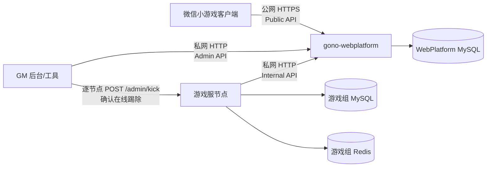

# WebPlatform：独立账号门户服务边界

> 本文描述**现行架构**。WebPlatform 的业务源码、OpenAPI、账号库 migration、测试、镜像和运行手册
> 归独立 Git 仓 **`gono-webplatform`**；本游戏仓只保存消费边界与精确锁定的契约生成物。
> 游戏服规则见 [SERVER.md](SERVER.md)，客户端接入见 [CLIENT.md](CLIENT.md)，GM 流程见
> [GM-TOOL-SPEC.md](GM-TOOL-SPEC.md)。

## 1. 定位与拓扑

WebPlatform 是本游戏专属的账号 plane：一游戏一实例集群、一游戏一套独立账号库。它负责身份、
会话权威、角色存在性登记和选服目录，不拥有玩法档、经济、房间或游戏 Redis。



边界铁律：

- 客户端只访问 WebPlatform **Public HTTP**；`portalUrl` 是必填启动配置，不回退游戏服。
- 游戏服只访问 WebPlatform **Internal HTTP**，且只经
  `apps/server/src/platform/webPlatformClient.ts`。
- GM 工具只经 **Admin HTTP** 写账号权威；写成功后仍须逐个直连游戏节点踢在线。
- 游戏进程没有账号库 DSN；WebPlatform 没有游戏库或游戏 Redis 凭证。
- WebPlatform 保持 MySQL-only，不持游戏 coord Redis，也不把广播当作踢人送达保证。
- 当前不建设跨游戏中心账号。第二个游戏应另起 WebPlatform 与账号库。

## 2. 数据所有权

| 独立 WebPlatform 账号库 | 游戏组 |
|---|---|
| `accounts`：微信身份、账号状态、画像 | Redis 玩法档、组侧 session cache |
| `account_sessions`：`(user_id, server_id)` 会话权威 | `user_currency`、ledger、订单、邮件、战绩等玩法/经济表 |
| `char_registry`：账号在某区是否建过角色 | 角色的等级、背包、进度等权威玩法态 |
| `login_audit`：登录与 Admin 操作审计 | 在线连接表、组内顶号与游戏节点 `/admin/kick` |
| `seq`、`schema_migrations` | 游戏库自己的 migration/bootstrap |

账号库从空库由 `gono-webplatform` migration 初始化。本仓
`npm --workspace @game/server run db:bootstrap` **只建游戏库**，并应断言上述账号表不存在。
没有旧数据迁移、双写、CDC 或共库回退路径。

会话单端语义作用域是 `(账号, serverId)`：同区再次登录替换旧 token，不同区互不影响；
封号仍是账号级，Admin ban 会作废该账号全部区的权威 session。

## 3. HTTP v1 契约

OpenAPI 唯一真源在独立仓。所有 JSON 错误使用：

```json
{ "code": "INVALID_PAYLOAD", "requestId": "01J..." }
```

token 对客户端和游戏服都是不透明字符串。响应不得泄露 `openid`、`unionid`、`session_key`、
DSN 或内部异常文本。

### 3.1 Public API

| 方法与路径 | 用途 |
|---|---|
| `POST /v1/sessions/wechat` | 微信 `code` + `serverId` 登录 |
| `POST /v1/sessions/dev` | 非生产本地登录；生产启用必须拒绝启动 |
| `GET /v1/areas` | 选服目录；可选 Bearer 用于回填我的区 |

登录成功固定返回：

```json
{
  "userId": "u_10001",
  "accessToken": "opaque-token",
  "isNewAccount": true
}
```

两种登录请求都必须携带 `serverId`；微信入口还带 `code`，开发入口带 `devKey`，`deviceId` 可选。
客户端保存字段 `accessToken`，不得继续读取旧字段或猜 token 结构。

`GET /v1/areas` 在已有登录态时使用：

```text
Authorization: Bearer <accessToken>
```

无 token 或 token 无效仍返回目录，只是 `myServerIds=[]`。成功响应：

```json
{
  "isOps": false,
  "hash": "8fd1a4",
  "servers": [
    {
      "serverId": 1,
      "name": "一区·启程",
      "tag": "normal",
      "status": "smooth",
      "openTime": 1700000000,
      "gameHttpUrl": "https://s1-api.example.com",
      "gameWsUrl": "wss://s1-ws.example.com"
    }
  ],
  "myServerIds": [1]
}
```

`openTime` 是 Unix 秒；`tag` 为 `normal|new|full|maintenance`，`status` 为
`smooth|busy|maintenance`。`gameHttpUrl` 与 `gameWsUrl` 不互相推导，`portalUrl` 是客户端全局
配置，不进入区服条目。目录状态只改善 UX，真正的进服准入仍由游戏服硬闸。

### 3.2 Internal API

Internal 调用必须带独立服务身份：

```text
x-service-id: game-server
x-service-secret: <WEBPLATFORM_SERVICE_SECRET>
```

| 方法与路径 | 用途 |
|---|---|
| `POST /v1/internal/sessions/verify` | 校验 `accessToken + serverId` |
| `PUT /v1/internal/characters/{userId}/{serverId}` | 幂等登记角色存在性 |
| `GET /v1/internal/characters/{userId}/{serverId}` | F4 判据：该区是否曾建角 |

verify 身份无效使用 HTTP 200 + 结果枚举，而不是把玩家问题与服务故障混在一起：

```json
{ "valid": false, "reason": "MISMATCH" }
```

`reason` 只允许 `NOT_FOUND|MISMATCH|BANNED|DEREGISTERED|EXPIRED`。成功：

```json
{ "valid": true, "userId": "u_10001", "issuedAtMs": 1780000000000 }
```

`issuedAtMs` 来自账号库 `account_sessions.token_issued_at`，是游戏服
`writeGroupSess` 的单调栅栏。Internal 的 401/403 是服务身份配置错误，5xx/超时是账号服务故障；
游戏服不得把它们谎报成玩家 token 过期。仅 `valid:false` 映射玩家鉴权失败。

角色登记返回 `{registered:true}`，查询返回 `{exists:boolean}`；这里只表达存在性，不传玩法数据。

### 3.3 Admin API

Admin 使用与 Internal 不同的凭证：

```text
x-admin-secret: <WEBPLATFORM_ADMIN_SECRET>
x-operator-id: <operator>
```

| 方法与路径 | 事务语义 |
|---|---|
| `POST /v1/admin/accounts/{userId}/ban` | `status=1` + 删除全部区 session + 写 `ban` 审计 |
| `POST /v1/admin/accounts/{userId}/revoke` | 删除全部区 session + 写 `revoke` 审计，不封账号 |

请求固定为：

```json
{ "operationId": "gm-20260727-000001", "reason": "外挂" }
```

`operationId` 是 Admin 操作幂等键。同一操作号、动作、账号的重放返回首次结果；复用到不同动作或账号
返回 `409 OPERATION_CONFLICT`。响应：

```json
{ "accountExists": true, "status": "banned" }
```

`status` 为 `banned|revoked|not_found`。账号不存在也返回 HTTP 200 与
`{accountExists:false,status:"not_found"}`，方便 GM 明确区分输入错误与基础设施失败。

Admin 写权威只保证“下次登录/新建连接被拒”。已建立连接的游戏 RPC 走组缓存快路径，因此 ban/revoke
成功后必须继续执行 [GM 两步 SOP](GM-TOOL-SPEC.md) 的逐节点 kick。

### 3.4 System API

| 路径 | 语义 |
|---|---|
| `GET /livez` | 只证明进程与事件循环可响应，不访问外部依赖 |
| `GET /readyz` | 检查 MySQL 与 migration 版本；未就绪返回 503 |
| `GET /version` | 服务版本、契约版本、schema 版本与 git SHA |

## 4. 契约在本仓的消费方式

独立仓从 OpenAPI 生成并发布零依赖 `@gono/webplatform-contract`。它只能包含路径/方法常量、请求响应
类型、错误码与版本信息，不包含 HTTP server、MySQL 或领域实现。

本仓精确锁定一个版本，并把它镜像到 Cocos 可消费的普通 TS：

```bash
npm run sync:webplatform-contract
npm run verify:webplatform-contract
```

生成目录：

```text
apps/shared/src/generated/webplatform/
```

该目录禁手改；manifest 记录契约版本和内容 hash。同步会级联
`shared → apps/client/src/shared → apps/Cocos/assets/src`，`typecheck` 先执行只读漂移校验。
服务端可直接 import 契约包，客户端从 shared 生成物 import。

跨仓升级顺序：

1. 独立仓修改 OpenAPI、实现和契约测试。
2. 发布新的精确契约版本。
3. 本仓升级锁定依赖并执行 `sync:webplatform-contract`。
4. 适配游戏服 Internal client 与客户端 Public 调用。
5. 两仓 contract test、typecheck 和集成冒烟全部通过后部署。

## 5. 游戏仓配置与失败语义

游戏服只持 HTTP client 配置：

| 环境变量 | 说明 |
|---|---|
| `WEBPLATFORM_INTERNAL_URL` | 无凭据、无 path/query/hash 的 Internal http(s) origin |
| `WEBPLATFORM_SERVICE_ID` | Internal 调用方标识 |
| `WEBPLATFORM_SERVICE_SECRET` | Internal 服务密钥；生产缺失拒启 |
| `WEBPLATFORM_CONNECT_TIMEOUT_MS` | TCP/TLS 建连预算 |
| `WEBPLATFORM_REQUEST_TIMEOUT_MS` | 单次逻辑调用总预算（含有限重试） |
| `WEBPLATFORM_BREAKER_FAILURES` | 熔断阈值 |
| `WEBPLATFORM_BREAKER_OPEN_MS` | 熔断打开时长 |

游戏服没有 `WEBPLATFORM_MYSQL_URL` 或任何账号库凭证。Internal client 对 verify 只做有限幂等重试；
超时、5xx、响应超限、非 JSON/形状漂移分别保留为基础设施或契约错误，不降级本地实现。

客户端 `Main.portalUrl` 必填 Public origin；本地例 `http://127.0.0.1:2570`，生产必须 HTTPS 并加入
微信合法域名。区服选择后，游戏业务 HTTP/Colyseus 使用目录的 `gameHttpUrl`，而不是 portal origin。

## 6. 部署与安全

- Public 与 Internal/Admin 必须分监听面或等价的网络策略；Public 只经公网 LB/WAF，Internal/Admin
  只允许游戏服与 GM 后端网段。
- Internal 与 Admin 使用不同密钥，生产缺失相应密钥时对应监听面拒绝启动；密钥走 KMS/Secret Manager。
- WebPlatform MySQL 只允许 WebPlatform 实例和 migration job 访问；游戏服安全组不得访问账号库。
- 只信任明确配置的代理 CIDR；日志脱敏 token、微信身份、session_key 与密钥。
- WebPlatform 独立发布、独立 migration job、独立 Docker 镜像；应用启动只校验 schema 版本。
- WebPlatform 不直接踢游戏连接。GM 工具对全部在役节点逐个确认 `/admin/kick` 的 HTTP 200，
  才能声明在线踢除完成。

## 7. 退役方案（历史说明，不是可选部署模式）

以下均为拆仓前的过渡实现，已经退役：

- monorepo 内 `apps/WebPlatform` 业务包与 `@game/webplatform` 源码依赖；
- 游戏进程内嵌账号逻辑、运行期 `ACCOUNT_MODE` 切换与 MySQL pool 注入；
- 客户端 portal 地址留空后回退游戏服；
- 游戏服承载登录、选服、账号管理兼容端点；
- 游戏库创建或修改账号表。

这些内容只可在 Git 历史/评审留档中出现，不能作为当前代码入口、部署选项或测试捷径。
生产源码边界由 `apps/server/test/lib-import-ban.test.ts` 无白名单机检。

## 8. 非目标与后续

拆仓当前不包含跨游戏中心账号、多设备同区并存、账号 Redis、WebPlatform 自持游戏 coord Redis、
动态服务发现、完整运营目录后台、账号画像完整产品接入或支付迁移。这些能力若立项，应在独立仓
扩展 OpenAPI/migration，并按 §4 的跨仓契约流程演进，不能重新把领域逻辑搬回游戏仓。
