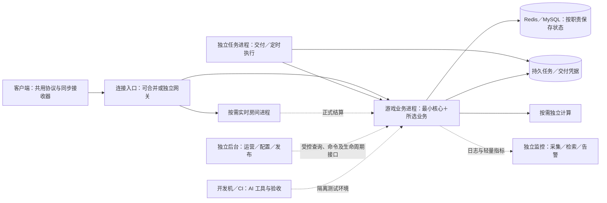

# 面向 AI 开发的最小游戏服务端框架

> 目标架构设计，更新于 2026-09-11。由原 `gameKit1.md` 重组；当前实现与约束仍见 [服务端开发说明](../SERVER.md)，实现状态仍以 [plan-v5](../plan-v5.md) 为准。

**游戏业务进程只装处理玩家操作所必需的框架能力与所选业务；监控、部署、管理后台、备份和 AI 开发工具在进程外运行，通过明确的接口协作。** 让 AI 少读无关代码、让业务少做重复接线、让进程容易替换，是同一个设计目标。

这里的“最小化”同时约束代码依赖、运行负担和开发认知成本。必要的权限、写入保护与恢复依据仍属于底线；一个完整上线系统可以有外围能力，而游戏核心保持小。

## 1. 目标怎样落到功能和边界

| 我们的目标 | 框架必须提供什么 | 如何决定运行位置 | 如何验收 |
|---|---|---|---|
| G1 核心最小化 | 按需装配、明确依赖、薄接口、最小启动配置 | 请求校验／状态提交／同步留在游戏进程；监控分析、部署调度、后台页面、AI 工具独立运行 | 关闭外围控制平台仍可处理已获授权的普通请求；检查运行依赖、空闲资源与启动条件 |
| G2 AI 高效开发、验证和找问题 | 可查契约、统一业务入口、可运行示例、隔离启动、局部验证、关联错误 | 示例、生成器、测试、诊断汇总在开发机或 CI；进程只提供必要诊断信息 | 固定需求、模型与权限，实测手写改动、有效反馈时间、总耗时、人工介入和故障定位结果 |
| G3 业务开发简单、双端一致 | 共用一份协议定义；Action 组织请求，Bean/Mod 风格描述数据及自动同步 | 共享契约是公共库；服务端在提交后产生状态变化，客户端接收器统一应用 | 新增字段无需分别维护两套协议，业务响应不重复携带玩家状态；零值、删除和重连正确 |
| G4 数据可靠、进程可恢复 | 数据权威声明、并发保护、稳定操作编号、原子提交、结果查证 | 已提交数据与必要交付凭据在 Redis/MySQL；进程内对象只是计算中的工作副本 | 提交前后杀进程，已提交数据可重载，重试不重扣、不重发；存储故障单独演练 |
| G5 多进程隔离和扩缩容 | 按角色启动、路由、资源预算、任务认领、排空及旧实例写入保护 | 业务、后台任务、重计算和房间按职责运行；托管与扩缩容决策在外部 | 比较单实例、多实例、跨机和缩容结果，测实际吞吐及共享存储瓶颈 |
| G6 外围可替换、故障不拖垮玩家操作 | 有版本的接口、有界输出、配置版本、超时和降级规则 | 游戏核心依赖接口与适配器，不依赖监控平台、后台或发布系统的内部实现 | 断开日志接收器、后台及配置发布服务，验证有界资源和明确降级；关键审计不能静默丢失 |
| G7 正式上线可验证、可维护 | 发布检查、告警、备份恢复、权限审计和质量证据 | 生产配套独立运行；游戏进程提供健康、排空、查证和受控业务接口 | 故障能发现、定位、止损和恢复，记录目标容量、可接受数据损失与恢复时间 |

## 2. 游戏进程内究竟保留什么

| 最小能力 | 留在进程里的部分 | 不随核心常驻的部分 |
|---|---|---|
| 模块装配 | 所选模块的登记、依赖检查、初始化和资源收尾 | 包市场、管理页面、开发生成器 |
| 请求入口 | 接收／分发、身份与权限执行、参数校验、限流、超时和错误映射 | 平台账号系统、全局风控分析；连接网关可按负载独立 |
| 共用契约 | 双端共用请求／响应／同步结构、消息名和对外错误码；必要运行时校验 | 协议编辑界面与编译工具；服务端私有字段不发布给客户端 |
| 数据与提交 | 按需加载、变更追踪、锁或版本保护、事务、幂等和结果凭据 | 数据库服务本身、备份程序、全库扫描和数据分析 |
| 状态自动同步 | 对已提交状态生成授权快照／增量、版本和重连补齐入口 | 客户端 UI、资源发布平台；独立网关负责向连接送达时使用统一契约 |
| 生命周期和诊断 | 启停／就绪／排空、资源上限、结构化日志、轻量指标、关联标识 | 进程托管、机器监控、日志检索、告警、发布控制器 |
| 扩展接入 | 所选业务需要时装配领域模块；跨系统操作在提交时登记可靠交付凭据 | 全量业务库、后台消费循环、定时调度器、重计算和实时房间运行时 |

这些能力的子功能见 [核心能力](core.md)。核心不向业务暴露“随处直接改 Redis／SQL”的捷径，业务模块通过所属数据的正式写入口执行。

## 3. 运行结构：谁在游戏进程外

图中的任务与交付凭据是逻辑职责，可能保存在同一 MySQL 事务或 Redis 原子边界内，**不是要求另建一套数据库、再分别写两次**。任务消费者也可装配相同领域模块直接执行正式提交；同一数据只有一个被声明的所有者与写入规则。

| 部署选择 | 明确的约束 |
|---|---|
| 初期少量进程 | 连接入口和普通业务可合并；Redis/MySQL 在业务进程外；监控、发布、后台、AI 工具始终不装进游戏进程，可先用外部命令行工具代替完整平台 |
| 启用后台或重计算 | 增加对应 worker 进程；可共用代码库与构建版本，但由角色清单控制导入与启动，不因导入模块就启动所有角色 |
| 开启实时房间 | 按需运行房间角色；局内临时状态可以在内存，崩溃续局需要额外恢复设计 |
| 扩大规模 | 独立扩网关、业务或 worker；先验证路由、共享写保护、任务认领与连接补齐，再据实扩容量 |

独立进程可以先部署在同一机器；故障影响还取决于 CPU、内存和磁盘限额。独立目录、独立包或线程都不能代替进程隔离。具体分工见 [进程与状态](runtime.md)。

## 4. 外围独立，游戏进程仍承担哪些接口责任

| 外围系统 | 外围负责 | 游戏进程仅保留 |
|---|---|---|
| 监控与告警 | 收集、存储、聚合、查询、阈值判断和值班通知 | 输出脱敏日志、有限维度指标、健康状态及必要业务事件；不在请求中等待监控服务器 |
| 部署与扩缩容 | 构建分发、启动／停止、重启退避、滚动替换、实例数量决策 | 校验配置与版本，报告就绪，响应排空并释放资源；不下载新版本或自行管理其他进程 |
| 运营与客服后台 | 登录、审批、页面、跨模块查询汇总、批量任务编排 | 按权限查询数据，执行明确的业务命令，校验区服、范围、幂等及审计；不开放任意 SQL／脚本接口 |
| 配置与备份 | 编辑、校验、发布配置；备份调度、存储恢复与演练 | 使用经过校验的版本快照，报告当前版本；提供必要维护与结果核对接口 |
| AI 开发工具 | 查契约、改代码、生成、启动测试、汇总诊断及验证证据 | 真实可查的能力信息和有边界的测试／诊断接口；生产不内嵌 AI 代理、提示词调度或测试运行器 |

“只提供接口数据”适用于观察类能力；补偿、封禁和排空等操作还需要**窄范围、可授权、可查证的命令接口**。命令中的业务规则仍在服务端执行。详细契约与外围故障行为见 [独立配套系统](platform.md)。

## 5. 从最小框架走到上线

| 步骤 | 必须得到的结果 |
|---|---|
| 先做一条最小链 | 共享协议 → 统一入口 → 受保护地加载／计算／提交 → 自动同步 → 查证与重连；用一个最小业务证明即可 |
| 验证进程边界 | 外围系统停机不导致无关玩家请求失败；游戏进程重启可恢复；多实例和后台角色不会重复提交 |
| 配齐首发所需能力 | 增加所选业务组件与独立的发布、监控、审计、备份恢复能力；付费、聊天等一旦启用，相关保障必须在上线前验收 |
| 用证据优化 | 比较手写代码、AI 反馈耗时、运行依赖、内存、吞吐、恢复时间；不把删检查或移走代码本身当作效率提升 |

## 6. 按问题阅读，主文档不再展开全部业务

| 要了解什么 | 文档 |
|---|---|
| 核心需要哪些小接口和子功能 | [core.md](core.md) |
| 状态、任务、多进程、扩缩容怎样工作 | [runtime.md](runtime.md) |
| 监控、部署、后台等如何独立，以及不可用时怎么办 | [platform.md](platform.md) |
| 钱包、邮件、排行、房间与客户端等按需能力 | [extensions.md](extensions.md) |
| AI 开发路径、手写工作量及质量验收 | [ai-validation.md](ai-validation.md) |
| 17 条原则、八层职责和术语 | [principles.md](principles.md) |
| 原 30 个模块、251 项子功能分别去了哪里 | [catalog.md](catalog.md) |
| Alloy、gameKit、eerie-server 的参考依据 | [references.md](references.md) |
