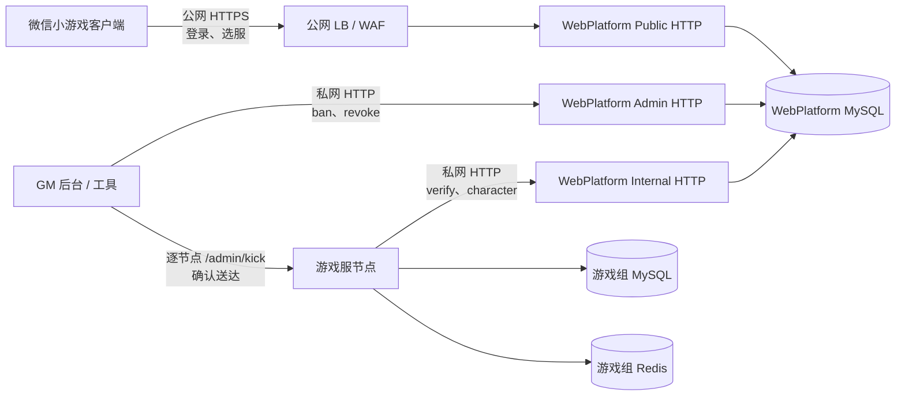

# WebPlatform 独立仓库与 HTTP-only 服务实施计划

> 状态：本地实施完成，待首次发布与部署验证
> 制定日期：2026-07-27
> 适用范围：`gonoGame` 与即将建立的独立 WebPlatform 仓库
> 变更性质：Breaking change，不兼容现有 WebPlatform API
> 注（2026-08-19）：游戏仓 CI 定义（`.github/workflows/ci.yml`）已随拆仓提交移除，下文涉及
> 「游戏仓 CI」的表述均为计划时状态，当前机检仅本地执行。独立仓自身的 CI 流水线不受影响。

## 实施状态（2026-07-27）

本计划的代码、契约、测试、CI 定义和文档收口已经在本地完成：

- 独立 Git 仓 `gono-webplatform` 已建立，具备 OpenAPI 单源、契约包、空库
  migration、Public/Internal/Admin 双监听、Dockerfile、CI 与 tag release 流水线。
- 游戏仓已删除 `apps/WebPlatform`、旧登录/选服端点、账号表与所有 in-process/模式切换路径，
  客户端和游戏服分别只走 Public/Internal HTTP。
- 契约已按 `@gono/webplatform-contract@1.0.0` tarball 精确锁定并同步到 shared/client/Cocos；
  本次 breaking change 将 `PROTOCOL_VERSION` 提升为 3。
- 本地已通过独立仓单元/契约/真实 MySQL 集成、游戏仓 typecheck/客户端/服务端/真实栈集成，
  以及两个 Node 进程、独立账号库与游戏库的 31 项完整拓扑冒烟。

仍需在有外部权限和基础设施的环境完成首次发布门：

1. 创建独立远端仓并推送当前 `main`。
2. 配置 npm/GHCR 凭证并发布 `v1.0.0`；游戏仓 CI 已固定引用该 tag，禁止 `latest`。
3. 在具备 Docker 的 runner 实际执行镜像 build、migration job、容器 smoke、SBOM 与漏洞扫描。
4. 配置 KMS/Secret、LB/WAF、安全组和真实微信凭证，并完成生产验收。

## 0. 已确认前提

本计划基于以下已经确认的事实与决策：

1. 线上尚无业务流量。
2. 没有需要兼容的旧客户端。
3. 没有需要迁移的线上账号数据。
4. WebPlatform 使用全新的独立账号库，直接从空库初始化。
5. WebPlatform 拆分为独立 Git 仓库。
6. WebPlatform 以后只通过 HTTP 提供服务，不再提供源码包或 in-process 调用方式。
7. 本次不建设跨游戏中心账号服务。WebPlatform 仍然是一游戏一实例、一游戏一账号库。
8. WebPlatform 保持 MySQL-only，不接入游戏 Redis、不运行玩法逻辑、不承担踢在线广播。

因此，本次实施不做：

- 旧 API 兼容。
- 旧客户端代理。
- 双写。
- MySQL CDC。
- 数据回填或数据迁移。
- `ACCOUNT_MODE=in-process` 回退。
- 游戏服与 WebPlatform 共库运行。

实施原则是：在一个 breaking-change 开发分支中完成新旧替换，所有验收通过后整体合入。

---

## 1. 实施目标

### 1.1 最终形态



最终必须满足：

- WebPlatform 有独立仓库、独立发布流水线、独立 Docker 镜像。
- WebPlatform 有独立 MySQL migration 和独立数据库凭证。
- 游戏仓库不包含 WebPlatform 业务源码。
- 游戏进程不能访问账号库。
- WebPlatform 进程不能访问游戏库和游戏 Redis。
- 客户端直接访问 WebPlatform Public API。
- 游戏服只访问 WebPlatform Internal API。
- GM 工具只访问 WebPlatform Admin API，并继续执行逐游戏节点踢在线。
- 游戏服的账号依赖只有一个 HTTP client，不存在本地实现和运行期模式切换。

### 1.2 非目标

本次不包含：

- 多游戏共用一套账号服务。
- 同区多设备同时在线。
- Redis 化账号 session。
- WebPlatform 自持 coord Redis。
- WebPlatform 直接踢游戏节点在线连接。
- 微信支付迁移。
- 角色玩法状态迁移到 WebPlatform。
- 账号画像 `bindProfile`、`bindPhone` 的完整产品接入。
- 动态服务发现或完整运营配置后台。

账号画像、动态选服目录和运营后台可以在拆仓完成后单独立项。

---

## 2. 当前耦合盘点

当前 `apps/WebPlatform` 虽然已有 Fastify 独立入口，但仍存在以下仓库级和运行时耦合。

### 2.1 源码耦合

- `apps/server` 依赖 `@game/webplatform`。
- `inProcessAccount.ts`、`inProcessLogin.ts` 直接 import `@game/webplatform/lib`。
- `core/infra/mysql.ts` 通过 `useServerPool()` 把游戏服连接池注入 WebPlatform lib。
- `ACCOUNT_MODE` 在 `in-process` 与 `http` 两种实现之间切换。
- WebPlatform 依赖游戏仓的 `@game/shared`。

### 2.2 数据库耦合

以下账号表仍定义在游戏服的 `apps/server/sql/schema.sql`：

- `accounts`
- `account_sessions`
- `char_registry`
- `login_audit`
- `seq`

游戏服的 `db-bootstrap.ts` 仍负责账号表的增量 ALTER。

### 2.3 测试耦合

- 大量游戏服测试直接 import `@game/webplatform/lib`。
- 大量测试直接向 `accounts`、`account_sessions`、`char_registry`、`login_audit` 写测试数据。
- 当前所谓 split e2e 是同进程启动 Fastify、共用一个 MySQL，不能证明真实独立部署成立。
- WebPlatform 自身没有完整独立的测试入口，领域测试主要寄生在游戏服测试目录。

### 2.4 部署耦合

- WebPlatform 生产启动依赖 `tsx`。
- 没有独立 Dockerfile。
- 没有独立 migration 命令。
- 没有完整的 SIGTERM 排空与连接池关闭。
- `/healthz` 同时承担进程存活和数据库健康，缺少 liveness/readiness 分离。
- Internal/Admin 端点没有独立监听面和服务身份鉴权。

拆仓不能只移动 `apps/WebPlatform` 目录；以上四类耦合都必须解除。

---

## 3. 仓库与所有权设计

### 3.1 新仓库

建议仓库名：

```text
gono-webplatform
```

建议使用路径过滤方式保留 `apps/WebPlatform` 的 Git 历史。历史保留不是上线前置条件，但优先于直接复制目录。

目标目录：

```text
gono-webplatform/
├── src/
│   ├── main.ts
│   ├── app.ts
│   ├── config.ts
│   ├── http/
│   │   ├── public/
│   │   │   ├── wxLogin.ts
│   │   │   ├── devLogin.ts
│   │   │   └── areaList.ts
│   │   ├── internal/
│   │   │   ├── verifySession.ts
│   │   │   ├── registerCharacter.ts
│   │   │   └── hasCharacter.ts
│   │   ├── admin/
│   │   │   ├── banAccount.ts
│   │   │   └── revokeAccount.ts
│   │   └── system/
│   │       ├── livez.ts
│   │       ├── readyz.ts
│   │       └── version.ts
│   ├── domain/
│   │   ├── account/
│   │   ├── session/
│   │   ├── character/
│   │   └── directory/
│   └── infra/
│       ├── mysql/
│       ├── wechat/
│       ├── security/
│       └── observability/
├── openapi/
│   └── openapi.yaml
├── packages/
│   └── contract/
├── config/
│   └── areas.example.json
├── migrations/
│   └── 0001_initial.sql
├── test/
│   ├── unit/
│   ├── integration/
│   └── contract/
├── scripts/
├── Dockerfile
├── package.json
├── package-lock.json
├── tsconfig.json
└── README.md
```

### 3.2 WebPlatform 仓拥有

- WebPlatform HTTP API。
- OpenAPI 契约。
- 账号领域逻辑。
- 微信 `code2session` 接入。
- 账号库 schema 和 migration。
- 选服目录读取与响应组装。
- WebPlatform 单元测试、数据库集成测试、契约测试。
- Docker 镜像构建。
- WebPlatform 运行手册和告警指标。
- `@gono/webplatform-contract` 契约包的发布。

### 3.3 游戏仓拥有

- 游戏服、玩法和房间。
- 游戏组 Redis 和 MySQL。
- 游戏服本地 session cache。
- strict verify 成功后的组 session 懒填与 `issuedAtMs` 栅栏。
- 同区顶号后的组内踢人。
- GM `/admin/kick` 游戏节点端点。
- WebPlatform HTTP client。
- 客户端及 Cocos 同步链。

### 3.4 明确禁止

- WebPlatform 仓依赖 `@game/shared`。
- 游戏仓依赖 WebPlatform 源码或 Git 仓库路径。
- 游戏服持有 `WEBPLATFORM_MYSQL_URL`。
- WebPlatform 持有 `MYSQL_URL`、Redis URL 或游戏节点 Redis 凭证。
- WebPlatform 发布 `./lib` 给游戏服直调。
- 测试以“方便”为理由重新引入跨仓源码 import。

---

## 4. HTTP API 契约

### 4.1 通用约定

- API 前缀：`/v1`。
- 请求与响应编码：UTF-8 JSON。
- 时间戳默认使用毫秒 Unix 时间，字段名以 `Ms` 结尾；选服目录的 `openTime`
  为现有领域约定的 Unix 秒，作为明确例外保留。
- ID：
  - `userId`：账号 uid。
  - `serverId`：区服 ID，整数 `0..65535`。
- token 对客户端和游戏服均视为不透明字符串。
- Public 用户 token 使用 `Authorization: Bearer <token>`。
- Internal 调用使用独立服务密钥。
- Admin 调用使用独立管理密钥。
- 所有响应带 `x-request-id`。
- 未映射异常统一返回 `INTERNAL`，不得回显 MySQL 错误、DSN、openid、unionid 或 session_key。
- Fastify route 必须使用运行期 JSON Schema 校验，不能只依赖 TypeScript 泛型。

### 4.2 统一错误形状

```json
{
  "code": "INVALID_PAYLOAD",
  "requestId": "01J..."
}
```

Public 错误码：

| code | HTTP | 含义 |
|---|---:|---|
| `INVALID_PAYLOAD` | 400 | 入参不合法 |
| `AUTH_REQUIRED` | 401 | 用户 token 无效或微信登录凭证无效 |
| `ACCOUNT_BANNED` | 403 | 账号被封 |
| `NOT_FOUND` | 404 | 端点或资源不存在 |
| `RATE_LIMITED` | 429 | 登录限流 |
| `INTERNAL` | 500 | 未映射内部错误 |
| `UPSTREAM_UNAVAILABLE` | 503 | 微信等上游暂不可用 |

Internal/Admin 错误码：

| code | HTTP | 含义 |
|---|---:|---|
| `INVALID_PAYLOAD` | 400 | 入参不合法 |
| `SERVICE_AUTH_REQUIRED` | 401 | 服务密钥缺失或错误 |
| `SERVICE_FORBIDDEN` | 403 | 调用方无权限 |
| `OPERATION_CONFLICT` | 409 | 同一操作号对应不同目标或动作 |
| `RATE_LIMITED` | 429 | 管理或内部接口限流 |
| `INTERNAL` | 500 | 未映射内部错误 |

### 4.3 Public API

#### `POST /v1/sessions/wechat`

请求：

```json
{
  "code": "wx.login 返回的 code",
  "serverId": 107,
  "deviceId": "optional-device-id"
}
```

约束：

- `code`：1–128 字符。
- `serverId`：整数 `0..65535`。
- `deviceId`：可空，最长 64 字符。
- 先限流，再调用微信 `code2session`。
- `openid`、`unionid`、`session_key` 永不返回客户端。
- 登录签发的 token 只对该 `serverId` 有效。

成功：

```json
{
  "userId": "u_10001",
  "accessToken": "opaque-token",
  "isNewAccount": true
}
```

#### `POST /v1/sessions/dev`

请求：

```json
{
  "devKey": "local_user_1",
  "serverId": 1,
  "deviceId": "optional-device-id"
}
```

约束：

- `devKey`：`^[a-zA-Z0-9_-]{1,32}$`。
- 只在非生产环境启用。
- `NODE_ENV=production` 且启用 dev-login 时，进程必须拒绝启动。
- 其余建号、签发、审计逻辑必须与微信登录走同一领域入口。

#### `GET /v1/areas`

可选请求头：

```text
Authorization: Bearer <accessToken>
```

无 token 或 token 无效时仍正常返回服务器目录，但 `myServerIds=[]`。

成功：

```json
{
  "isOps": false,
  "hash": "8fd1a4",
  "servers": [
    {
      "serverId": 1,
      "name": "一区·启程",
      "tag": "normal",
      "status": "smooth",
      "openTime": 1700000000,
      "gameHttpUrl": "https://s1-api.example.com",
      "gameWsUrl": "wss://s1-ws.example.com"
    }
  ],
  "myServerIds": [1]
}
```

约束：

- `gameHttpUrl` 与 `gameWsUrl` 分开。
- `portalUrl` 是客户端全局启动配置，不进入每区条目。
- 目录展示可以弱一致。
- 游戏服 `onAuth` 仍是区服准入权威，客户端目录状态不能替代服务端硬闸。
- 可选 token 只能用于回填展示用的 `myServerIds`，不能授予玩法权限。

### 4.4 Internal API

#### `POST /v1/internal/sessions/verify`

请求：

```json
{
  "accessToken": "opaque-token",
  "serverId": 107
}
```

成功：

```json
{
  "valid": true,
  "userId": "u_10001",
  "issuedAtMs": 1780000000000
}
```

身份无效：

```json
{
  "valid": false,
  "reason": "MISMATCH"
}
```

`reason` 枚举：

- `NOT_FOUND`
- `MISMATCH`
- `BANNED`
- `DEREGISTERED`
- `EXPIRED`

语义：

- 身份无效使用 HTTP 200 + `valid:false`。
- HTTP 401/403 表示游戏服的服务身份无效。
- HTTP 5xx/超时表示 WebPlatform 故障。
- 游戏服不得把 WebPlatform 故障映射成玩家 token 错误。
- `issuedAtMs` 必须来自 MySQL 的 `account_sessions.token_issued_at`，不得用应用进程 `Date.now()` 代替。

#### `PUT /v1/internal/characters/{userId}/{serverId}`

语义：

- 幂等登记 `(userId, serverId)`。
- 已存在仍返回成功。
- 使用 ODKU/no-op 或等价幂等写法，禁止 `INSERT IGNORE`。
- 仅接受通过服务鉴权的游戏服调用。

响应：

```json
{
  "registered": true
}
```

#### `GET /v1/internal/characters/{userId}/{serverId}`

响应：

```json
{
  "exists": true
}
```

用途：

- 游戏服 F4 数据丢失判据。
- 只表达“该账号是否曾在该区建过角色”。
- 不返回角色经济、背包或玩法数据。

### 4.5 Admin API

#### `POST /v1/admin/accounts/{userId}/ban`

请求：

```json
{
  "operationId": "gm-20260727-000001",
  "reason": "外挂"
}
```

调用方身份从经过鉴权的 `x-operator-id` 请求头取得，不接受请求体覆盖。

响应：

```json
{
  "accountExists": true,
  "status": "banned"
}
```

事务内执行：

1. 查询账号是否存在。
2. `accounts.status=1`。
3. 删除该账号全部 `account_sessions`。
4. 写 `login_audit(event=ban)`。
5. 提交。

账号不存在时返回 HTTP 200：

```json
{
  "accountExists": false,
  "status": "not_found"
}
```

#### `POST /v1/admin/accounts/{userId}/revoke`

请求与 ban 相同。

事务内执行：

1. 查询账号是否存在。
2. 删除该账号全部 `account_sessions`，不修改正常账号状态。
3. 写 `login_audit(event=revoke)`。
4. 提交。

响应：

```json
{
  "accountExists": true,
  "status": "revoked"
}
```

#### Admin 操作幂等

- `operationId` 必填。
- `login_audit.operation_id` 建唯一索引。
- 同一 `operationId`、同一动作、同一账号的重放返回首次结果。
- 同一 `operationId` 被用于不同动作或不同账号时返回 `409 OPERATION_CONFLICT`。
- ban/revoke 的数据库状态变化本身也必须幂等。

### 4.6 System API

#### `GET /livez`

- 只证明进程和事件循环仍可响应。
- 不访问 MySQL 和微信。
- 成功返回 HTTP 200。

#### `GET /readyz`

- 检查 MySQL 可连接。
- 检查 migration 版本达到当前二进制要求。
- 不主动调用微信接口。
- 未就绪返回 HTTP 503。

#### `GET /version`

返回：

```json
{
  "service": "gono-webplatform",
  "serviceVersion": "1.0.0",
  "contractVersion": "1.0.0",
  "schemaVersion": 1,
  "gitSha": "..."
}
```

---

## 5. 契约单源与跨仓消费

### 5.1 单一真源

`gono-webplatform/openapi/openapi.yaml` 是 WebPlatform HTTP API 的唯一真源。

由它生成：

- WebPlatform route request/response 类型。
- 零依赖 TypeScript 契约包。
- JSON Schema。
- API 文档。

不得在游戏仓手写另一份相同接口类型。

### 5.2 契约包

发布：

```text
@gono/webplatform-contract
```

契约包只能包含：

- 路径常量。
- 请求类型。
- 响应类型。
- 错误码常量。
- schema/contract 版本。
- 必要的零依赖纯函数。

契约包不得包含：

- Fastify。
- MySQL。
- Node API。
- WebPlatform 领域实现。
- 游戏服实现。

### 5.3 游戏仓接入

游戏仓根 `devDependencies` 精确锁定版本：

```json
{
  "@gono/webplatform-contract": "1.0.0"
}
```

不使用 `^` 或 `~`。

新增命令：

```text
npm run sync:webplatform-contract
npm run verify:webplatform-contract
```

生成目标：

```text
apps/shared/src/generated/webplatform/
```

规则：

- 生成目录禁止手改。
- 生成物必须携带契约版本和内容 hash。
- `verify:webplatform-contract` 比较已安装契约包与生成物，漂移即失败。
- `sync:webplatform-contract` 完成后级联现有 `sync:shared`，最终灌入 `apps/client` 和 `apps/Cocos`。
- `typecheck` 与 CI 必须挂 `verify:webplatform-contract`。

这样可以维持 Cocos 侧普通 TS 文件消费，同时不让 `apps/shared` 引入运行时 npm 依赖。

---

## 6. 独立账号库

### 6.1 数据库名称

建议：

```text
webplatform_gono
```

开发环境也必须与游戏库分开：

```text
game_gono
webplatform_gono
```

WebPlatform 只读取：

```text
WEBPLATFORM_MYSQL_URL
```

禁止回退到 `MYSQL_URL`。缺失时拒绝启动。

### 6.2 初始表

初始 migration 创建：

1. `accounts`
2. `account_sessions`
3. `char_registry`
4. `login_audit`
5. `seq`

#### `accounts`

保留当前账号字段：

- `user_id`
- `openid`
- `unionid`
- `status`
- `created_at`
- `last_login_at`
- `session_key`
- `nickname`
- `avatar_url`
- `phone`

约束：

- `PRIMARY KEY(user_id)`。
- `UNIQUE(openid)`。
- `UNIQUE(unionid)`。
- `status`：0 正常、1 封禁、2 注销。
- 不再添加 token 列。

#### `account_sessions`

- `user_id`
- `server_id`
- `token_hash`
- `token_issued_at`
- `PRIMARY KEY(user_id, server_id)`

规则：

- 会话单端语义作用域为 `(账号, 区)`。
- 同区再次登录替换旧 token。
- 不同区互不影响。
- `token_issued_at` 对同一 `(user_id, server_id)` 必须严格递增。

#### `char_registry`

- `user_id`
- `server_id`
- `created_at`
- `PRIMARY KEY(user_id, server_id)`

本次只落存在性字段。角色名、等级、角色头像、最近登录等展示投影后续另做 migration。

#### `login_audit`

至少包含：

- `id`
- `operation_id`
- `user_id`
- `event`
- `operator`
- `caller`
- `target_exists`
- `reason`
- `ip`
- `device_id`
- `created_at`

建议宽度：

- `operation_id VARCHAR(64)`
- `event VARCHAR(24)`
- `operator VARCHAR(64)`
- `caller VARCHAR(64)`
- `target_exists TINYINT UNSIGNED`
- `reason VARCHAR(255)`
- `device_id VARCHAR(64)`

索引：

- `PRIMARY KEY(id)`
- `UNIQUE(operation_id)`，允许普通登录事件传 NULL。
- `INDEX(user_id, created_at)`

`target_exists` 对普通登录事件为 NULL，对 Admin ban/revoke 固化首次执行时的账号存在性结果，
用于同一 `operationId` 重放时返回与首次相同的响应。

#### `seq`

- `name`
- `val`
- `PRIMARY KEY(name)`

初始 migration 必须预置：

```text
name=user_id, val=0
```

### 6.3 Migration 纪律

- WebPlatform 使用自己的 `schema_migrations` 版本表。
- 每个 migration 只执行一次。
- migration 由部署 job 在应用滚动前执行。
- 应用启动只校验版本，不自动执行破坏性 migration。
- schema 演进使用 expand → deploy → contract。
- 不把 down migration 当作生产回滚方案。
- 初始库为空，因此本次不写数据迁移脚本。

### 6.4 账号写事务

以下操作必须在 WebPlatform 内部完成，不允许拆成调用方多个 HTTP 请求：

- ban：状态更新 + 清 session + 审计。
- revoke：清 session + 审计。
- 管理操作幂等占位 + 状态变化 + 审计。

登录当前包含建号、签发、last-login、审计多个写点。本次拆仓至少保持当前语义；独立仓内追加专项测试，防止出现“token 已轮换但客户端收到 500 且无审计”的分叉。

---

## 7. 选服目录

### 7.1 本次实现

拆仓第一版使用 WebPlatform 仓内配置文件：

```text
config/areas.json
```

通过 `DirectoryProvider` 抽象加载：

```ts
interface DirectoryProvider {
  listAreas(): Promise<AreaDirectory>;
}
```

第一版实现：

```text
FileDirectoryProvider
```

要求：

- 启动时读取并进行运行期 schema 校验。
- 配置非法时拒绝启动。
- 目录 hash 根据规范化后的完整目录计算。
- 不在源码中硬编码 demo 数组。
- URL 必须使用 `https://` 或 `wss://`；开发环境允许 localhost 的 http/ws。

### 7.2 后续演进

需要动态开关服或运营后台时，新增：

```text
MysqlDirectoryProvider
```

或者对接服务发现/配置中心。替换 provider 不改变 Public API。

服务器负载、维护状态和角色摘要仍是展示投影；真正的进服准入继续由游戏服 `onAuth` 判断。

---

## 8. 安全边界

### 8.1 监听面

建议一个进程创建两个 Fastify 实例或两个监听器：

```text
WEBPLATFORM_PUBLIC_HOST
WEBPLATFORM_PUBLIC_PORT=2570
WEBPLATFORM_INTERNAL_HOST
WEBPLATFORM_INTERNAL_PORT=2571
```

Public 监听面只注册：

- `/v1/sessions/*`
- `/v1/areas`
- `/livez`
- `/readyz`
- `/version`

Internal 监听面只注册：

- `/v1/internal/*`
- `/v1/admin/*`
- 内部健康检查。

禁止仅靠路由注释区分公开与内部端点。

### 8.2 服务鉴权

Internal：

```text
x-service-id: game-server
x-service-secret: <WEBPLATFORM_SERVICE_SECRET>
```

Admin：

```text
x-admin-secret: <WEBPLATFORM_ADMIN_SECRET>
x-operator-id: <operator>
```

要求：

- Internal 与 Admin 使用不同密钥。
- 密钥从 KMS/Secret Manager 注入，不写入仓库。
- 使用恒时比较。
- 生产环境未配置对应密钥时，对应监听面拒绝启动。
- 记录调用方 service ID、operator、request ID，但不记录密钥。
- 支持双密钥轮换窗口：current + previous。

未来有服务网格时可以升级为 mTLS，但不能以“未来会有 mTLS”为理由取消本次共享密钥。

### 8.3 网络策略

- Public 端口只允许公网 LB/WAF 访问。
- Internal 端口只允许游戏服网段和 GM 后端网段访问。
- 数据库只允许 WebPlatform 实例和 migration job 访问。
- 游戏服安全组不得访问账号数据库。
- WebPlatform 安全组不得访问游戏 Redis 或游戏 MySQL。

### 8.4 真实 IP 与限流

- 只信任配置的代理 CIDR。
- 不使用“任意请求都信 X-Forwarded-For”的布尔开关。
- 公网主限流放在 LB/WAF。
- WebPlatform 保留进程内令牌桶作为第二道保护。
- 多实例部署时不得把进程内桶误认为全局限流。
- `INET6_ATON()` 前继续执行严格 IP 归一，非法值审计写 NULL，不能让审计失败破坏登录。

### 8.5 其他 HTTP 防护

- 设置 JSON body 大小上限。
- 设置 header 大小和请求超时。
- 不回显内部异常文本。
- 日志脱敏 token、openid、unionid、session_key、密钥。
- 公共登录接口配置并发和速率保护。
- Admin 接口配置更严格的速率限制与告警。

---

## 9. WebPlatform 可靠性设计

### 9.1 HTTP client 超时

游戏服调用 WebPlatform 必须使用：

- 明确的连接超时。
- 明确的总请求超时。
- AbortSignal。
- 结构化错误分类。

建议初始值：

```text
WEBPLATFORM_CONNECT_TIMEOUT_MS=200
WEBPLATFORM_REQUEST_TIMEOUT_MS=1000
```

不得无界等待。

### 9.2 重试规则

允许有限重试：

- session verify：网络错误或 502/503 时最多重试一次，受总超时约束。
- character exists：最多重试一次。
- character register：幂等 PUT，可有限重试。
- health/readiness：由探针按平台策略重试。

禁止自动重试：

- 微信登录签发。
- 非幂等或没有 operation ID 的管理写。
- 400、401、403、409。

### 9.3 熔断

游戏服 `WebPlatformClient` 增加简单熔断：

- 连续网络/5xx 失败达到阈值后短暂打开。
- 打开时 strict join 快速失败，避免请求堆积拖垮网关。
- 半开只放少量探测。
- 熔断不得把基础设施故障映射成 `AUTH_REQUIRED`。

### 9.4 失败语义

- strict verify 失败：连接准入 fail-closed。
- WebPlatform 不可达：返回系统繁忙/账号服务不可用，不宣称 token 错误。
- 选服目录不可达：客户端显示可重试错误，不静默使用未知旧地址。
- character exists 不可达：F4 判据不能猜测 false。
- character register 失败：进入修复流程，不能永久静默丢失。

### 9.5 角色登记修复

建角顺序保持：

1. 游戏 Redis 玩法档先创建。
2. 同步调用 WebPlatform `PUT character`。
3. 成功后清除对应 repair intent。
4. 失败时记录 durable repair intent。
5. 后台 worker 重试幂等 PUT，直至成功或进入告警。

repair intent 必须位于游戏组 durable Redis，不能放进内存队列。

建议键/流在实现前按服务端规则登记。目标是缩短“已有玩法档但 `char_registry` 暂缺”的窗口，同时维持“档先、registry 后”的防毒态顺序。

---

## 10. 新仓库实施任务

### WP-1：建立仓库与构建

- 建立独立 Git 仓库。
- 设置 Node ≥ 22。
- 建立 TypeScript ESM 配置。
- 配置 lint/typecheck/test/build。
- 生产构建输出 `dist/`。
- `npm start` 使用 `node dist/main.js`。
- 新增多阶段 Dockerfile。
- 镜像中不包含 devDependencies 和源码测试数据。

验收：

- `npm ci && npm run build && npm test` 全绿。
- `docker build` 成功。
- 镜像可在只有生产依赖的环境启动。

### WP-2：建立契约

- 编写 `openapi/openapi.yaml`。
- 定义 Public/Internal/Admin/System API。
- 生成契约包。
- 建立契约快照测试。
- 建立 breaking-change 检查。
- `/version` 返回契约版本。

验收：

- 服务端 route 与 OpenAPI 路径集合一致。
- 请求/响应 schema 漂移会让 CI 失败。
- 契约包为零依赖纯 TS。

### WP-3：迁移领域代码

从当前 `apps/WebPlatform/src/lib` 迁移：

- `auth.ts` → `domain/session`、`domain/account`。
- `login.ts` → `domain/account/login`。
- `character.ts` → `domain/character`。
- `area.ts` → `domain/directory`。
- `wxClient.ts` → `infra/wechat`。
- `mysql.ts` → `infra/mysql`。

迁移后：

- 删除 `useServerPool`。
- 删除所有 `@game/shared` import。
- 不导出领域 lib 给外部仓库。
- 所有领域错误使用 WebPlatform 自己的错误码，不 import 游戏服错误类。

### WP-4：独立数据库

- 编写 `0001_initial.sql`。
- 增加 `schema_migrations`。
- 增加 `npm run migrate`。
- 增加 migration 状态检查。
- 增加空库启动测试。
- 增加 migration 重跑幂等测试。

验收：

- 新建空 MySQL 8 数据库后，一条命令可初始化。
- WebPlatform 连接不到游戏数据库。
- 缺 `WEBPLATFORM_MYSQL_URL` 时拒绝启动。

### WP-5：实现 HTTP 层

- Public、Internal、Admin 分别注册。
- 所有 route 有运行期 schema。
- 实现统一错误处理。
- 实现 request ID。
- 实现 body limit。
- 实现日志脱敏。
- 实现服务密钥鉴权。
- 实现 Public/Internal 双监听面。

### WP-6：补事务与审计

- ban/revoke 改为事务。
- 管理请求记录 operationId/operator/caller。
- 登录审计落账号库。
- 管理操作错误不能出现“数据库已改但 HTTP 报失败且无审计”。
- 对重复操作建立幂等测试。

### WP-7：目录配置

- 删除源码 demo 数组。
- 新增 `config/areas.json`。
- 新增启动校验。
- 生成稳定目录 hash。
- 补 `gameHttpUrl` 与 `gameWsUrl`。

### WP-8：进程生命周期

- SIGTERM 后停止接收新请求。
- 等待在途请求到达 drain 截止时间。
- 关闭 Public/Internal listener。
- 关闭 MySQL pool。
- 超时后以非零状态退出并记录日志。
- `/livez` 与 `/readyz` 分离。

### WP-9：测试迁移

将当前游戏仓内属于 WebPlatform 领域的测试迁入新仓，包括：

- token 签发与校验。
- per-zone session。
- token issuedAt 单调性。
- ban/revoke。
- 登录限流。
- 微信熔断。
- openid/unionid 建号竞态。
- unionid 回填与双号审计。
- IP 归一。
- 审计字段钳制。
- area list 与 `myServerIds`。
- character register/query/has。
- dev-login 生产禁用。
- HTTP 未映射错误不泄漏。

---

## 11. 游戏仓实施任务

### GAME-1：接入契约生成

- 安装固定版本 `@gono/webplatform-contract`。
- 新增同步和校验脚本。
- 生成 public 契约到 `apps/shared/src/generated/webplatform/`。
- 更新客户端 import。
- 将契约校验挂进根 `typecheck` 和 CI。

### GAME-2：建立 HTTP-only client

新增：

```text
apps/server/src/platform/webPlatformClient.ts
```

建议接口：

```ts
export interface WebPlatformClient {
  verify(accessToken: string, serverId: number): Promise<{
    userId: string;
    issuedAtMs: number;
  }>;
  registerCharacter(userId: string, serverId: number): Promise<void>;
  hasCharacter(userId: string, serverId: number): Promise<boolean>;
}
```

client 负责：

- base URL。
- 服务鉴权头。
- request ID。
- 超时。
- 有限重试。
- 熔断。
- HTTP 状态和业务 reason 映射。
- 运行期响应校验。

client 不负责：

- 登录。
- area list。
- ban/revoke。
- GM 踢人。
- 账号数据库。

### GAME-3：删除双模式

删除：

- `apps/server/src/platform/inProcessAccount.ts`
- `apps/server/src/platform/inProcessLogin.ts`
- `ACCOUNT_MODE`
- `@game/webplatform`
- `useServerPool`
- `apps/server/src/core/infra/mysql.ts` 中的 WebPlatform 池注入
- 游戏服登录编排

`accountClient.ts` 可以删除，或重命名为 `webPlatformClient.ts`。不得保留只有一个实现却继续伪装成双模式的抽象。

### GAME-4：删除游戏服门户端点

删除游戏服侧：

- `/account/wx-login`
- `/account/dev-login`
- `/area/list`

客户端不再回退到游戏服地址。

如果保留同名目录或文件会触发 HTTP loader 契约校验，应同步更新 route 注册表和测试。

### GAME-5：清理账号数据库

从 `apps/server/sql/schema.sql` 删除：

- `accounts`
- `account_sessions`
- `char_registry`
- `login_audit`
- `seq`

从 `apps/server/tools/db-bootstrap.ts` 删除相应 ALTER 和预置行。

从 smoke、表清单、README、SERVER 文档删除账号表归属。

确认游戏服生产源码中不存在针对以上表的 SQL。

### GAME-6：改造账号相关编排

- LobbyRoom/GameRoom strict auth 调 `webPlatformClient.verify`。
- verify 成功后继续使用 `issuedAtMs` 写组 Redis session 栅栏。
- `stale` 仍必须拒绝本次准入。
- 快路径仍只查游戏组 Redis，不逐消息回源 WebPlatform。
- F4 调 `hasCharacter`，WebPlatform 不可达时不得猜测无角色。
- 建角后的登记改成 HTTP PUT，并增加 durable repair intent。
- 同区顶号仍由游戏组 session 更新和 kickBus 完成。

### GAME-7：清理封号编排

GM 直接调用 WebPlatform Admin API，因此删除或重构当前游戏服中“先 account.ban/revoke 再广播”的内部编排。

保留：

- 游戏节点 `/admin/kick`。
- 本节点在线连接索引。
- 组内 kickBus。
- 顶号自动踢。

封号 SOP 仍是：

1. GM → WebPlatform Admin ban/revoke。
2. GM → 全部在役游戏节点 `/admin/kick`。

### GAME-8：客户端修改

- `portalUrl` 变为必填启动配置，禁止回退游戏服 base URL。
- `net/http/account.ts` 改用 `/v1/sessions/wechat`、`/v1/sessions/dev`。
- `net/http/area.ts` 改用 `GET /v1/areas` 和可选 Authorization header。
- 类型改为生成的 WebPlatform public contract。
- `serverSession` 使用 `serverId/gameHttpUrl/gameWsUrl`。
- 更新 Cocos `Main` 暴露字段与 tooltip。
- 执行 `sync:shared` 和 `sync:client`。

### GAME-9：测试重构

删除所有：

- `import "@game/webplatform"`。
- `import "@game/webplatform/lib"`。
- 直接写账号表的游戏服测试夹具。
- 同进程 `buildServer()` 启 WebPlatform 的测试。

重新分层：

1. `WebPlatformClient` 单元测试使用受控 HTTP mock。
2. 游戏服领域测试使用 client 依赖注入或 mock server。
3. 真集成测试启动已发布的 WebPlatform Docker 镜像。
4. 真集成测试使用独立账号库和游戏库。
5. 测试账号通过 dev-login API 创建。
6. 封禁和撤销通过 Admin API 操作。
7. 测试不读取 WebPlatform 内部表判断结果，优先通过 API 和游戏行为验收。

---

## 12. 本地开发与 CI

### 12.1 本地拓扑

游戏仓提供开发 compose 或等价脚本，启动：

- MySQL：游戏库。
- MySQL：WebPlatform 账号库。
- 游戏 durable Redis。
- 游戏 cache Redis。
- 游戏 coord Redis。
- WebPlatform 固定版本镜像。
- 游戏服。

建议环境变量：

```text
WEBPLATFORM_PUBLIC_URL=http://127.0.0.1:2570
WEBPLATFORM_INTERNAL_URL=http://127.0.0.1:2571
WEBPLATFORM_SERVICE_ID=game-server
WEBPLATFORM_SERVICE_SECRET=dev-service-secret
WEBPLATFORM_ADMIN_SECRET=dev-admin-secret
```

两个仓联调时，可以先本地构建相同 tag 的 WebPlatform 镜像，再由游戏仓 compose 引用。不得用相对源码路径 mount 来恢复跨仓 import。

### 12.2 WebPlatform CI

每次 PR：

1. install。
2. typecheck。
3. unit tests。
4. 启动 MySQL 8。
5. 空库 migration。
6. integration tests。
7. OpenAPI contract tests。
8. breaking-change check。
9. build。
10. Docker build。
11. 容器启动 smoke。

主分支或 tag：

1. 发布契约包。
2. 构建并推送不可变镜像 tag。
3. 生成 SBOM/镜像扫描结果。
4. 发布 release notes。

### 12.3 游戏仓 CI

每次 PR：

1. 安装固定契约包。
2. `verify:webplatform-contract`。
3. shared/server/client typecheck。
4. 单元测试。
5. 启动两套独立数据库。
6. 启动 Redis。
7. 启动固定 tag 的 WebPlatform 镜像。
8. 等待 WebPlatform `/readyz`。
9. 启动游戏服。
10. 执行登录 → 进大厅 → 进房 → 角色登记完整冒烟。
11. 执行 WebPlatform 不可达/超时故障测试。

游戏仓 CI 必须钉死镜像 tag，不使用 `latest`。

---

## 13. 发布与部署

### 13.1 发布物

WebPlatform 每次正式发布产生：

- `@gono/webplatform-contract@X.Y.Z`
- `gono-webplatform:X.Y.Z`
- OpenAPI 文档。
- migration 版本。
- release notes。

镜像 `/version` 返回的信息必须与镜像 tag、契约版本一致。

### 13.2 首次部署顺序

因为没有旧业务和数据，首次部署采用：

1. 创建空账号数据库。
2. 运行 WebPlatform migration job。
3. 注入微信、数据库、Internal/Admin 密钥。
4. 部署 WebPlatform。
5. 确认 `/livez` 和 `/readyz`。
6. 验证 Public 入口无法访问 Internal/Admin。
7. 部署游戏服，配置 Internal URL 和服务密钥。
8. 运行 dev/test 登录或测试微信登录。
9. 验证 strict verify 和组 session 懒填。
10. 部署新客户端，配置 WebPlatform Public URL。
11. 执行完整冒烟。

### 13.3 后续滚动升级顺序

1. 先发布向后兼容的 WebPlatform contract/service 扩展。
2. 运行 expand migration。
3. 部署 WebPlatform。
4. 部署游戏服和客户端。
5. 观察旧字段/旧路径无使用。
6. 下一次 major 或明确窗口再 contract。

本次首次拆分可以不兼容旧实现，但完成上线后必须开始遵守上述版本纪律。

### 13.4 回滚

本次没有旧数据可回退，因此首次部署失败时：

- 可以删除并重新初始化尚未承载业务的账号库。
- 可以回滚 WebPlatform 镜像。
- 可以回滚游戏服到同一套新 HTTP 契约下的前一版本。

一旦正式产生真实账号数据：

- 禁止把流量切回游戏库账号表。
- 禁止重新启用 in-process。
- 应回滚应用镜像，而不是回滚数据库写入方向。
- migration 必须通过 expand/contract 保证旧二进制仍能短期运行。

---

## 14. 分阶段执行清单

### 阶段 A：契约与仓库骨架

- [x] 创建 `gono-webplatform` 仓库。
- [x] 建立 build/test/Dockerfile。
- [x] 定稿 OpenAPI v1。
- [x] 建立契约生成与发布。
- [x] 定义 Public/Internal/Admin 双监听。
- [x] 定义环境变量与启动校验。

完成门：

- 空服务可以构建镜像。
- OpenAPI 可以生成契约包。
- `/livez`、`/version` 可用。

### 阶段 B：数据库与领域迁移

- [x] 编写空库初始 migration。
- [x] 迁移账号、session、character、login、wx 逻辑。
- [x] 删除 `useServerPool`。
- [x] 实现事务化 ban/revoke。
- [x] 实现审计 operationId/operator/caller。
- [x] 实现文件型选服目录。

完成门：

- 新仓在独立 MySQL 上完成全部领域集成测试。
- 不依赖游戏仓代码。

### 阶段 C：HTTP 与安全

- [x] 实现 Public API。
- [x] 实现 Internal API。
- [x] 实现 Admin API。
- [x] 实现运行期 schema。
- [x] 实现统一错误和日志脱敏。
- [x] 实现服务鉴权和密钥轮换。
- [x] 实现可信代理 CIDR。
- [x] 实现 liveness/readiness。
- [x] 实现 SIGTERM drain。

完成门：

- 网络面隔离测试全绿。
- 未配置生产密钥时 fail-fast。
- 未映射异常不泄漏。

### 阶段 D：游戏服切 HTTP-only

- [x] 接入契约包。
- [x] 实现 `webPlatformClient`。
- [x] 替换 verify/character 调用。
- [x] 保留 `issuedAtMs` 栅栏。
- [x] 增加超时、重试和熔断。
- [x] 增加 character durable repair。
- [x] 删除 in-process、`ACCOUNT_MODE` 和池注入。

完成门：

- 游戏服生产源码无 WebPlatform 源码 import。
- 游戏服只持 Internal URL/密钥，不持账号库 DSN。

### 阶段 E：客户端切新 Public API

- [x] portal URL 改为必填。
- [x] 登录改新 API。
- [x] 选服改新 API。
- [x] 使用 `gameHttpUrl/gameWsUrl`。
- [x] 更新 shared 生成物。
- [x] 同步 client/Cocos。

完成门：

- 客户端不访问游戏服登录/选服旧路径。
- portal URL 缺失时启动明确失败，不静默回退。

### 阶段 F：删除 monorepo 旧实现

- [x] 删除 `apps/WebPlatform`。
- [x] 删除 workspace 和 package-lock 对应项。
- [x] 删除 `@game/webplatform` 依赖。
- [x] 删除游戏服登录/area 端点。
- [x] 删除账号表和 bootstrap ALTER。
- [x] 删除直写账号表测试。
- [x] 退役 WebPlatform 双模式文档口径（保留仍有效的区服拓扑资料）。

完成门：

```text
rg "@game/webplatform|apps/WebPlatform|ACCOUNT_MODE|useServerPool" .
```

除历史文档或明确迁移记录外无生产命中。

### 阶段 G：真实拓扑验证

- [x] CI 启动 WebPlatform 独立进程（流水线已实现；待固定镜像首次发布后在 runner 执行）。
- [x] CI 使用独立账号库和游戏库（流水线已实现；本地已用两个独立 schema 验证）。
- [x] 通过 API 创建测试账号。
- [x] 完成登录 → 选服 → strict verify → 大厅 → 战斗房冒烟。
- [x] 验证 ban → 重新登录拒绝。
- [x] 验证 revoke → 可重新登录。
- [x] 验证 WebPlatform 超时不会被误报为 token 无效。
- [x] 验证 character register 失败后的 repair。

完成门：

- 真实双进程双库集成测试全绿。

### 阶段 H：文档收口

- [x] 更新根 `AGENTS.md`。
- [x] 更新 `README.md`。
- [x] 更新 `docs/OVERVIEW.md`。
- [x] 更新 `docs/SERVER.md`。
- [x] 重写 `docs/WEBPLATFORM.md` 为跨仓边界和契约索引。
- [x] 更新 `docs/HANDOFF-M12.md`，标记双模式为历史。
- [x] 更新 `docs/GM-TOOL-SPEC.md` 新 Admin API 和鉴权头。
- [x] 更新 `todo.md`，关闭 W1/W2/A4 中由本次解决的部分。

---

## 15. 验收测试清单

### 15.1 登录

- [ ] 新微信账号首次登录返回 `isNewAccount=true`。
- [ ] 同 openid 再登录返回同一 userId 和 `isNewAccount=false`。
- [ ] 同区二次登录替换旧 token。
- [ ] 不同区 token 互不替换。
- [ ] 旧 token 在 strict verify 返回 `MISMATCH`。
- [ ] 被封账号登录返回 `ACCOUNT_BANNED`。
- [ ] 非法 code/deviceId/serverId 返回 `INVALID_PAYLOAD`。
- [ ] 生产环境 dev-login 不存在且无法通过配置误开。
- [ ] token、openid、unionid、session_key 不进入响应或普通日志。

### 15.2 游戏服鉴权

- [ ] strict verify 成功返回 userId 和 issuedAtMs。
- [ ] 组 session 懒填成功。
- [ ] 迟到旧 verify 在栅栏上返回 stale 并拒绝准入。
- [ ] 非 strict 快路径不请求 WebPlatform。
- [ ] WebPlatform 401 映射为服务配置故障。
- [ ] WebPlatform 超时/503 映射为系统繁忙。
- [ ] `valid:false` 才映射为玩家身份失败。

### 15.3 角色登记

- [ ] 重复 PUT 幂等。
- [ ] `has` 对存在/不存在返回正确。
- [ ] 建档后 HTTP 登记失败会产生 durable repair intent。
- [ ] worker 重试成功后清 intent。
- [ ] F4 在 WebPlatform 不可达时不会猜测 `exists=false`。
- [ ] area list 的 `myServerIds` 来自 `char_registry`。

### 15.4 封号与撤销

- [ ] ban 原子更新 status、删除全部区 session、写审计。
- [ ] revoke 删除全部区 session、写审计但不封账号。
- [ ] 重复 operationId 幂等。
- [ ] operationId 冲突返回 409。
- [ ] 账号不存在返回明确结果。
- [ ] GM 完成权威写后逐节点 kick。
- [ ] 被 ban 用户不能重新登录或 strict join。
- [ ] 被 revoke 用户重新登录后可获得新 token。

### 15.5 安全与部署

- [ ] 公网入口无法访问 `/v1/internal/*`。
- [ ] 公网入口无法访问 `/v1/admin/*`。
- [ ] Internal 密钥不能调用 Admin。
- [ ] Admin 密钥不能冒充游戏服 Internal 调用。
- [ ] 密钥缺失时生产启动失败。
- [ ] XFF 仅从可信代理读取。
- [ ] MySQL 异常不泄漏原始错误。
- [ ] `/livez` 在数据库故障时仍可表达进程存活。
- [ ] `/readyz` 在数据库故障时返回 503。
- [ ] SIGTERM 停止接流并关闭 MySQL pool。

---

## 16. 可观测性

### 16.1 结构化日志字段

所有请求至少记录：

- `requestId`
- `route`
- `method`
- `statusCode`
- `durationMs`
- `callerType`
- `callerId`
- `userId`，仅在已验证且需要时记录
- `serverId`
- `operationId`
- `errorCode`

不得记录：

- accessToken。
- openid/unionid 明文。
- session_key。
- 微信 secret。
- Internal/Admin secret。
- 完整 MySQL DSN。

### 16.2 指标

至少暴露：

- HTTP 请求量、错误率、延迟。
- Public/Internal/Admin 分面统计。
- verify valid/invalid 计数，按 reason 聚合。
- 登录成功、封禁拒绝、限流、微信上游失败。
- MySQL pool 使用率和查询错误。
- 微信熔断器状态。
- character repair 积压量在游戏服侧监控。
- readiness 状态。

### 16.3 初始目标

建议初始 SLO：

- Internal verify 可用性 ≥ 99.95%。
- Internal verify p99 < 100ms，同 VPC 条件。
- 登录接口不把微信故障计为 WebPlatform 自身成功。
- Admin 操作必须有 durable 审计。

SLO 数值上线前应根据真实环境压测调整。

---

## 17. 风险与应对

| 风险 | 后果 | 应对 |
|---|---|---|
| 游戏服仍残留源码 import | 拆仓后无法构建或绕过 HTTP | 删除包依赖 + `rg`/CI 机检 |
| 游戏 schema 仍含账号表 | 双真源再次出现 | 从 DDL/bootstrap/smoke 一并删除 |
| 游戏测试直写账号库 | 跨仓 schema 被测试反向锁死 | 通过 API 建夹具，领域测试迁新仓 |
| Internal API 仅靠 VPC | 内网失陷可伪造角色/封号 | 服务密钥 + 网络策略 + 审计 |
| verify 超时拖住网关 | 连接堆积、事件循环压力 | 1s 总超时 + 熔断 + fail-fast |
| character HTTP 失败 | `char_registry` 长期缺行 | durable repair intent + 幂等 PUT |
| 进程内登录限流多实例失真 | 攻击流量被实例数放大 | 主限流放 LB/WAF |
| 契约包和服务镜像不匹配 | 运行期字段漂移 | 精确锁版本 + `/version` + 黑盒 CI |
| token 格式被游戏服解析 | WebPlatform 无法独立演进 | token 对消费者不透明，只信 verify 响应 |
| 旧文档继续描述双模式 | 后续开发误加 in-process | 文档收口 + 搜索机检 |

---

## 18. Definition of Done

只有以下条件全部满足，本次拆仓才算完成：

1. WebPlatform 独立仓可以独立 clone、install、migrate、test、build、run。
2. WebPlatform 独立镜像可以只依赖账号 MySQL 启动。
3. WebPlatform 不依赖游戏仓任何源码或 npm workspace。
4. 游戏仓不包含 `apps/WebPlatform`。
5. 游戏服不依赖 `@game/webplatform`。
6. 游戏服没有账号库 DSN。
7. 游戏库 schema 不包含五张账号表。
8. 客户端直接请求 WebPlatform Public API。
9. 游戏服只通过 Internal HTTP 调 verify/character。
10. GM 只通过 Admin HTTP 写账号权威，并继续逐游戏节点踢在线。
11. Public/Internal/Admin 有真实网络隔离和独立鉴权。
12. 契约以 OpenAPI 为单源，游戏仓生成物有漂移机检。
13. CI 真正运行两个 Node 进程和两个 MySQL 数据库。
14. 游戏测试不直接读写账号表。
15. 登录、选服、进大厅、进战斗房、封号、撤销完整冒烟全绿。
16. WebPlatform 超时、错误、重启和 SIGTERM 行为通过故障测试。
17. 所有相关文档不再把 in-process 描述为现行能力。

---

## 19. 推荐提交拆分

为降低单个提交的审查难度，建议按以下提交序列实施：

### WebPlatform 新仓

1. `chore: bootstrap standalone webplatform repository`
2. `feat(contract): define v1 public internal and admin APIs`
3. `feat(db): add standalone account database migrations`
4. `refactor(domain): migrate account session character and wechat logic`
5. `feat(http): implement public API`
6. `feat(http): implement authenticated internal API`
7. `feat(admin): implement transactional ban and revoke`
8. `feat(directory): load validated area configuration`
9. `feat(ops): add health shutdown metrics and container build`
10. `test: migrate account domain and black-box API coverage`
11. `release: publish contract and webplatform 1.0.0`

### gonoGame 仓

1. `build: consume pinned webplatform contract`
2. `feat(server): add HTTP-only webplatform client`
3. `refactor(auth): route strict verify through webplatform`
4. `refactor(character): route registry through webplatform`
5. `feat(character): add durable registry repair`
6. `feat(client): use webplatform v1 login and area APIs`
7. `test: add real split process and database topology`
8. `refactor(server): remove in-process account mode`
9. `refactor(db): remove account tables from game schema`
10. `chore: remove apps/WebPlatform workspace`
11. `docs: finalize standalone webplatform architecture`

每个提交应保持其所在仓库的 typecheck 和相关测试可运行；跨仓临时不兼容通过固定的契约包 prerelease 版本协调，不通过源码路径协调。
